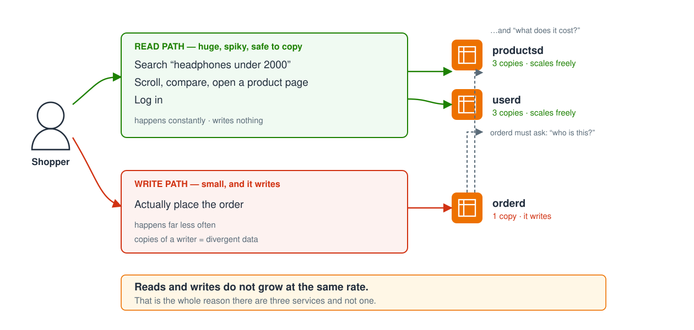
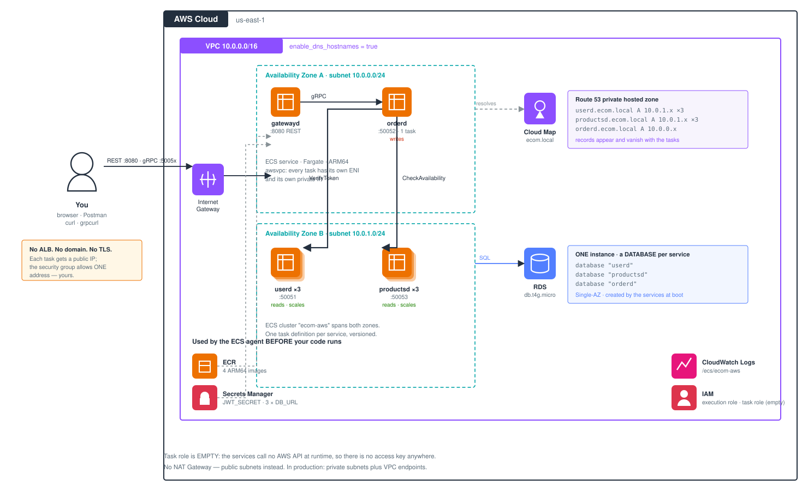
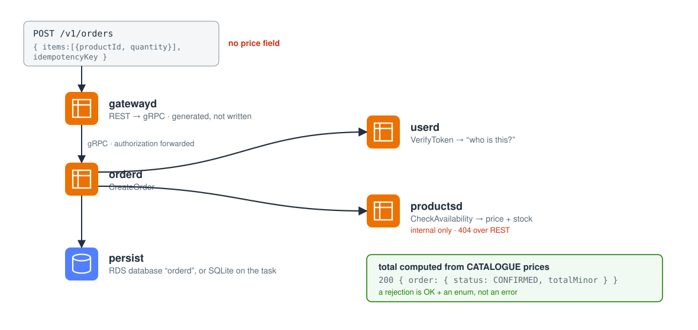

<!--
Present it:   make slides          -> http://localhost:8030, live reload
Export:       make slides-html / make slides-pdf

Speaker script is a SEPARATE file: PRESENTER.md - including the questions to
ask the room, which are deliberately not on the slides.

Diagrams are SVGs in docs/images/. They render in GitHub, Marp and PDF.
-->

# Running Go gRPC services on ECS

### From `localhost:50051` to production, with one set of Terraform modules

**Lakhan Samani** · AWS Community Day, Vadodara
`github.com/lakhansamani/grpc-ecs-demo`

---

## What you will leave with

1. **Why a gRPC service cannot run on Lambda** — and what that rules out.

2. **How one set of Terraform runs against a laptop and against AWS**,
   differing by a single provider block.

3. **The default that catches almost everyone.** gRPC's standard client sends
   every request to *one* server, even with three healthy ones in DNS.

Every number in these slides came out of a terminal in that repo.

---

# Part 1 · The use case

## It is sale season

Big Billion Days. Great Indian Festival. Whichever one is running right now.

Midnight. The banner goes live.

Everyone opens the app **at the same time**.

---

## What everyone is actually doing

| What they do | How often | Writes? |
|---|---|---|
| Search "headphones under 2000" | Constantly | **No** |
| Scroll, compare, open a product page | Constantly | **No** |
| Add to cart, then look at one more thing | Very often | No |
| **Actually place the order** | Far less often | **Yes** |

Most of a sale is **people looking**. A small slice is **people buying**.

---

## Suppose the store is one application

Traffic multiplies, so you scale up. More copies of the whole thing.

**And it works.** This is not a story about a bad decision. It is a story
about what it costs you:

- You scale **checkout** in order to survive **search** traffic
- A slow catalogue query and a checkout bug share one deploy and one page
- You cannot tune them separately — same process

---

## Two paths through one system



---

## So: three services

| Service | Job | Copies |
|---|---|---|
| `userd` | Accounts, login, tokens | **3** |
| `productsd` | Search, list, product pages | **3** |
| `orderd` | Places orders | **1** |

**A test you can use at work:** would these ever need a different number of
copies, a different deploy schedule, or a different on-call owner?

> **No to all three → it is one service.** Put it back.

---

## But now they have to talk to each other

Placing one order needs two questions answered by **other services**:

1. `userd` — *who is this person?*
2. `productsd` — *what do these cost, and are they in stock?*

Inside one application those were function calls. Now they cross a network.

**So: how should services call each other?**

---

# Part 2 · Why gRPC

## What gRPC is

**Call a function that lives on another machine, as if it were local.**

You write the function down — name, inputs, outputs — in a file. A compiler
turns that into real code for both sides.

```
RPC  =  Remote Procedure Call
g    =  gRPC Remote Procedure Calls   (the acronym contains itself)
```

---

## The mental shift

**REST** makes you think about *resources* and *verbs*:

```
POST /v1/orders        { "items": [...] }
```

**gRPC** makes you think about *functions*:

```protobuf
rpc CreateOrder(CreateOrderRequest) returns (CreateOrderResponse);
```

Everything else — HTTP/2, binary encoding, codegen — is machinery serving
that one idea.

---

## You write the contract. A compiler writes the code.

```protobuf
service OrderService {
  rpc CreateOrder(CreateOrderRequest) returns (CreateOrderResponse);
}
message RequestedItem { string product_id = 1; int32 quantity = 2; }
```

`make proto` turns it into Go **servers** and **clients**, a **REST gateway**,
an **OpenAPI** spec, and a **TypeScript** client.

> Forget to implement an RPC and it **will not compile**. That is a build
> failure on your laptop, not a 501 in production.

---

## Let me be honest about performance

**Real, by design:** binary Protobuf instead of JSON · one multiplexed HTTP/2
connection · headers not re-sent every request.

**But:** for most internal services the network and your database dominate.
I have not benchmarked this repo, so no speed-up number goes on a slide.

> Performance is a genuine benefit. It is just **not usually why teams
> switch** — the typed contract is.

---

## How much smaller? Measure it.

```sh
make wire-size
```

| Message | Protobuf | JSON | |
|---|---|---|---|
| `CreateOrderRequest`, 1 item | **27 B** | 80 B | 3.0× |
| `CreateOrderRequest`, 3 items | **51 B** | 152 B | 3.0× |
| `SearchProductsResponse`, 20 | **1782 B** | 3452 B | 1.9× |

Protobuf drops the field *names* and packs integers as varints. JSON repeats
every key on every object.

---

# Part 3 · Feeding a browser

## A browser cannot speak gRPC

It cannot open a raw HTTP/2 connection and control trailers. So something has
to translate.

| Option | Cost |
|---|---|
| **A gateway process** | one more thing to deploy |
| **Gateway in-process** | every service carries an HTTP stack |
| **ConnectRPC** — Connect, gRPC *and* gRPC-Web on one port | a different server library |

Connect's docs: it interops *"with `grpc-web` frontends without the need for
an intermediary proxy."*

---

## So do we need `gatewayd`?

# No.

It is a choice. I picked the gateway process because it makes the lesson
**visible** — a separate ECS service with its own task definition, deployed
next to stateful ones.

**When a gateway still earns its place:**

- One public door to audit, rate-limit and put a WAF in front of
- Your services must stay plain gRPC because another team owns them

---

## And no — not every RPC needs REST

Of the 10 RPCs here, **9 have a REST route. One does not.**

```protobuf
// NOTE: deliberately NO google.api.http option.
rpc CheckAvailability(...) returns (...);
```

```
REST  -> 404          gRPC  -> works
```

> **A REST route exists for a client you do not control.** Expose exactly
> those. Four lines of annotation are the whole difference.

---

# Part 4 · Where does it run?

## Four options, one ruled out by mechanics

| Option | Serves gRPC? | What you operate |
|---|---|---|
| **Lambda** | **No** | Nothing |
| **EC2** | Yes | AMIs, patching, scaling groups |
| **EKS** | Yes, very well | Control plane, nodes, CNI, upgrades |
| **ECS + Fargate** | Yes | A task definition and a service |

gRPC needs a **process that stays listening**. From the AWS docs on gRPC
target groups: *"You can't use Lambda functions as targets."*

---

## Why ECS for now — and when to leave

The question is not serverless versus containers. It is **how much
orchestration do four services actually need?**

Four services = four task definitions. An ECS **task role is just an IAM
role**.

**Kubernetes is genuinely excellent at this.** Move when you have dozens of
services and several teams, or need a real mesh.

> Moving later is **not a rewrite**. Only the YAML changes.

---

# Part 5 · The code



---

## One order, end to end



---

## The request has no price in it

```protobuf
message RequestedItem { string product_id = 1; int32 quantity = 2; }
```

The client sends *what* and *how many*. `orderd` asks `productsd` what it
costs.

**Think about the alternative during a sale.** If the client sends the price,
a client can ask *"is this ₹2,000 sale price real?"* — and then submit ₹200.

---

## You tap "Buy". The spinner spins.

Midnight, patchy 4G. Your phone sends the order and the response never comes
back. So it retries — reasonably; it has no idea whether the server got it.

**Did you just buy one phone, or two?**

That is what an **idempotency key** is for: a unique string per *intent to
buy*, sent with the order.

```
first call   -> Order abc123, idempotentReplay = false
same key     -> Order abc123, idempotentReplay = true
```

---

## Three details that make it actually work

- **Required.** No key → `InvalidArgument`. A retry-unsafe order API is a bug.
- **Namespaced per user**, so two shoppers cannot collide on `"cart-1"`.
- **A unique index backs it**, not just an `if`.

Two simultaneous retries race. One loses, catches the duplicate-key error,
and returns the stored order.

> The check alone is not enough. **The database constraint is what makes it
> true.**

---

## And "out of stock" is not an error

```
CreateOrder → OK, status = REJECTED, reason = OUT_OF_STOCK
```

Not `codes.Internal`. Not a 500. Status codes stay for *unauthenticated*,
*invalid argument*, *unavailable*.

> `if strings.Contains(err.Error(), "stock")` means a reworded message breaks
> production. **An enum cannot be reworded.**

---

## What decides whether a service can scale

Not its traffic. **Where its data lives.**

| `use_rds = false` | |
|---|---|
| `userd`, `productsd` | SQLite **baked into the image** — every copy identical → **3** |
| `orderd` | SQLite **in the task filesystem** — it writes → **1** |

> **Not** "because it writes". Writers scale fine.
> **Because it writes to a file inside the task.** Three copies would be
> three different databases.

---

## So give it a database, and the limit disappears

| `use_rds = true` | |
|---|---|
| all three | one Postgres instance, **a separate database each** → all scale |

```sh
terraform apply -var use_rds=true
```

**Default ON locally** (the emulator's Postgres is free) and **off on AWS**,
where it bills about six cents for a three-hour demo.

```sh
make show-guard   # terraform REFUSES orderd×3 on SQLite, ALLOWS it on RDS
```

The guard lifts itself, because the reason for it has gone.

---

## One instance, a database per service

```
db.t4g.micro
  ├── database "userd"        ├── database "productsd"
  └── database "orderd"
```

No shared tables, no accidental cross-service join — and you pay for one
instance.

**Terraform cannot create those databases:** `CREATE DATABASE` is SQL, and the
AWS provider only speaks the AWS API. So each service creates its own at boot
and seeds itself.

```sh
make seed-check    # driver, databases, and the seeding log lines
```

---

# Part 6 · The Terraform

## Six modules, four services, two environments

```
terraform/
├── modules/     network · ecr · ecs-cluster · iam · secrets
│                ecs-service · rds
├── deployment/  THE WHOLE DEPLOYMENT, loaded by both environments
└── envs/
    ├── local/   provider.tf  ← the only difference
    └── aws/     provider.tf  ← the only difference
```

`ecs-service` is instantiated **four times**. One `protocol` variable switches
the port mapping and the health-check mode.

---

## Every AWS component this creates

| Component | Why it is here |
|---|---|
| **VPC** + 2 subnets | `enable_dns_hostnames` is **required** for Cloud Map |
| **Security group** + 9 rules | a **self-referencing** rule is how services reach each other |
| **ECR** ×4 | private registry, `force_delete` so destroy is never blocked |
| **ECS cluster** + 4 services | keeps N tasks alive |
| **Cloud Map** namespace + 4 | creates a **Route 53 private hosted zone** |
| **Secrets Manager** | `JWT_SECRET`, and one `DB_URL` per service |
| **IAM** ×2 | execution role vs task role — next slide |

**22 resource types, ~45 actual resources.** No NAT Gateway, no ALB.

---

## The two IAM roles, because people conflate them

| Role | Who uses it | When |
|---|---|---|
| **Execution** | the ECS **agent** | **before** your code runs — pull image, read secrets, make log streams |
| **Task** | **your process** | at runtime |

Get it backwards and the task fails to start pointing at the wrong role.

**Ours is empty on purpose** — these services call no AWS API at runtime.

> `AWS_CONTAINER_CREDENTIALS_FULL_URI` is the whole story. You never created a
> key, so there is none to leak.

---

## Cloud Map is just DNS

`orderd` knows no IP addresses. It dials **`userd.ecom.local:50051`**.

ECS registers each task's IP; Cloud Map keeps the A records in a Route 53
private zone. Tasks come and go; the name does not.

```hcl
routing_policy = "MULTIVALUE"          # every healthy task, not just one
dns_records { type = "A"  ttl = 10 }   # low TTL, scale-out seen fast
health_check_custom_config { failure_threshold = 1 }
```

---

## A story about that last block

I had a deprecation warning, so I tidied it up — emptied the block. Then every
call failed with `code 14: no children to pick from`.

**What I checked, all fine:** 4 tasks RUNNING · 4 Cloud Map services · VPC DNS
enabled · security groups correct.

**The cause:** an *empty* block makes the provider send **no health config**.
Cloud Map then never accepts ECS's health reports → every instance UNHEALTHY →
**excluded from DNS**.

> Four healthy tasks. Zero addresses returned.

---

## The same error, a second cause

On ECS all four services are created at once, so `orderd` can boot **before**
`userd` has registered in Cloud Map.

First lookup finds nothing → `round_robin` starts with an empty list → the
same `no children to pick from`.

Fixed with a background loop that keeps retrying
(`grpcclient.KeepWarm`).

> One error string, two unrelated causes — and in both, **everything else
> looks fine.**

---

## One pipeline. Laptop and production.

```sh
diff terraform/envs/local/provider.tf terraform/envs/aws/provider.tf
```

Local has fake credentials and an `endpoints` block pointing at an emulator.
AWS has a region. **That is the whole diff.**

Everything describing the deployment lives in `terraform/deployment/` and
**both environments load the same files.**

> There is no second set of manifests to drift.

---

## Where the laptop version is honest

**Ministack** emulates ECS by launching real Docker containers, plus ECR,
Cloud Map, Secrets Manager, RDS and SSM.

| Gap | Stand-in |
|---|---|
| Cloud Map serves **no DNS** | `make dns` adds Docker aliases — discovery *is* only DNS |
| `awsvpc` tasks have **no host port** | `make forward`; on AWS it is SSM port forwarding |
| `healthStatus` / `launchType` not echoed | real ECS reports `HEALTHY` / `FARGATE` |

> Naming the limits yourself is more credible than being caught by them.

---

# Part 7 · Running it

## Demo 1 — is this really ECS?

```sh
make ps
```

**The task describes itself** — nothing in our code sets this:

```
ECS_CONTAINER_METADATA_URI_V4=http://.../v4/Iw-s54...
  Cluster : .../cluster/ecom-local      Family : userd rev 1
```

**And credentials arrive with no key existing:**

```
AWS_CONTAINER_CREDENTIALS_FULL_URI=http://.../v2/credentials/46e1...
```

---

## Demo 2 — the code, running

```sh
make demo          # gRPC
make dev-rest      # the same flow over REST
```

```
search  -> Wireless Noise Cancelling Headphones, ...
order   -> ORDER_STATUS_CONFIRMED  total=36997.0 INR  (2 lines priced)
replay  -> same order returned (replay=True)
reject  -> ORDER_STATUS_REJECTED | REJECTION_REASON_OUT_OF_STOCK
```

```
REST -> 404          gRPC -> works
```

---

## Demo 3 — the same Terraform, on real AWS

```sh
make tf-aws-apply        # ECR → push → apply → wait → print IPs
make ps-aws
eval "$(make -s aws-env)"
```

What changed from the laptop: **one provider block.**

Now real: Cloud Map does the DNS, `healthStatus: HEALTHY`,
`launchType: FARGATE`, tasks across two AZs.

```sh
make tf-aws-destroy      # drains, destroys, then VERIFIES
```

---

## No load balancer, no domain, just IPs

```sh
make aws-ip
```

```
userd      50051  35.172.110.136
gatewayd   8080   34.201.31.110
```

gRPC over plaintext HTTP/2 and REST both work on a bare IP. An ALB gRPC target
group would need HTTPS → a certificate → a domain.

> The cost: `awsvpc` gives each task its own IP, and it **changes** when the
> task is replaced. So re-run `make aws-ip`, never write it down.

---

# Part 8 · The default that catches everyone

## The setup

`userd` is scaled to **3 tasks**, and everything is correct.

| Check | |
|---|---|
| Tasks running | **3 of 3** |
| Cloud Map instances healthy | **3 of 3** |
| DNS answer for `userd.ecom.local` | **3 A records** |

I send **120 requests** through `orderd`, and every one makes `orderd` call
`userd`.

---

## 120 / 0 / 0

```
task 10e77597   120 calls     <- all of them
task 90c7be3b     0
task 02e3010a     0
```

No error. No log line. No failed health check. Every dashboard green.

Everybody's first conclusion is that service discovery is broken. **It is
not** — it handed back three addresses.

> ## The client never asked to balance.

---

## Why: `pick_first`

gRPC's default policy resolves the name, connects to **one** address, and
sends everything down that connection.

**And that is reasonable!** With HTTP/2 one connection multiplexes many
requests, so opening more looks wasteful. It optimises for the other end being
a single load balancer.

On ECS the other end is **three tasks with three IPs**.

> The default is not a bug. It is a correct answer to a different question.

---

## The fix is two halves

```go
grpc.NewClient("dns:///userd.ecom.local:50051",      // <- dns:/// matters
    grpc.WithDefaultServiceConfig(
        `{"loadBalancingConfig":[{"round_robin":{}}]}`))
```

A bare `host:port` uses the **passthrough** resolver and yields exactly one
address — so `round_robin` has nothing to balance over. Plus
`MaxConnectionAge` on the server, so clients re-resolve after a scale-out.

> That is the version that **looks** fixed and is not.

---

## Run it both ways yourself

```sh
make demo-lb-before     # gRPC's DEFAULT
make demo-lb-after      # the fix
```

```
pick_first                        round_robin
  24c2e5c4     +0                   24c2e5c4     +40
  59c81e0d     +120                 59c81e0d     +40
  f00e0830     +0                   f00e0830     +40
```

Same image, same task definition, same DNS. **Two client settings.**

---

## An ALB only covers the first hop

```
  internet ──▶ ALB ──▶ gatewayd ×3        <- the ALB balances this
                         │
                         └──▶ userd ×3     <- the ALB is NOT in this path
```

| Hop | Who balances it |
|---|---|
| internet → `gatewayd` | **the ALB**, per request |
| `gatewayd` → `userd` | **the client itself** |

> Add an ALB and stop there, and the inside of your system is still pinned to
> one task.

---

## What to take away

1. **Draw boundaries where copies, deploys or owners differ.**
2. **Adopt gRPC for the contract.** Performance is a bonus.
3. **Expose REST only where you do not control the client.**
4. **A gateway is a choice, not a requirement.**
5. **One Terraform stack, two provider blocks.**
6. **`pick_first` is the default** — three tasks, one gets everything.

---

## Green dashboards are not the same thing as working

Four tasks running, four Cloud Map services, DNS enabled — and zero addresses
returned.

Three healthy tasks, correct DNS — and one of them doing everything.

**Both looked perfectly fine.**

> Deploy it once before you trust it.

---

## Clone it and run it

### `github.com/lakhansamani/grpc-ecs-demo`

```sh
make test          # no Docker, no AWS needed
make local-up      # real ECS tasks on your laptop
make demo          # the whole flow
make slides        # these slides, on :8030
```

- `INSTRUCTIONS.md` — every `grpcurl` and `curl` command, by hand
- `docs/COMMANDS.md` — every `make` target, the code tour, the AWS path
- `docs/ARCHITECTURE.md` — what each AWS component is, why, how
- `SPEC.md` — every decision, marked verified or assumed

**Thank you. Questions?**
