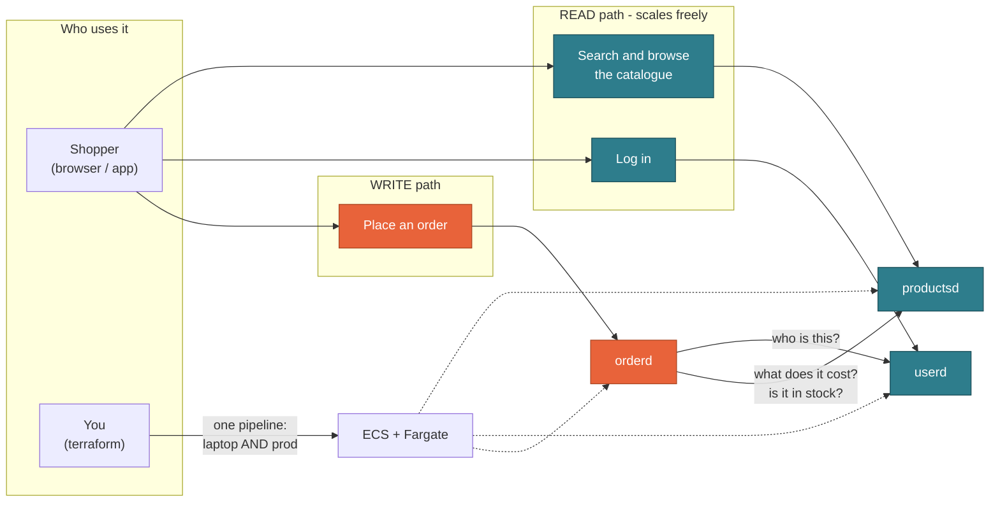
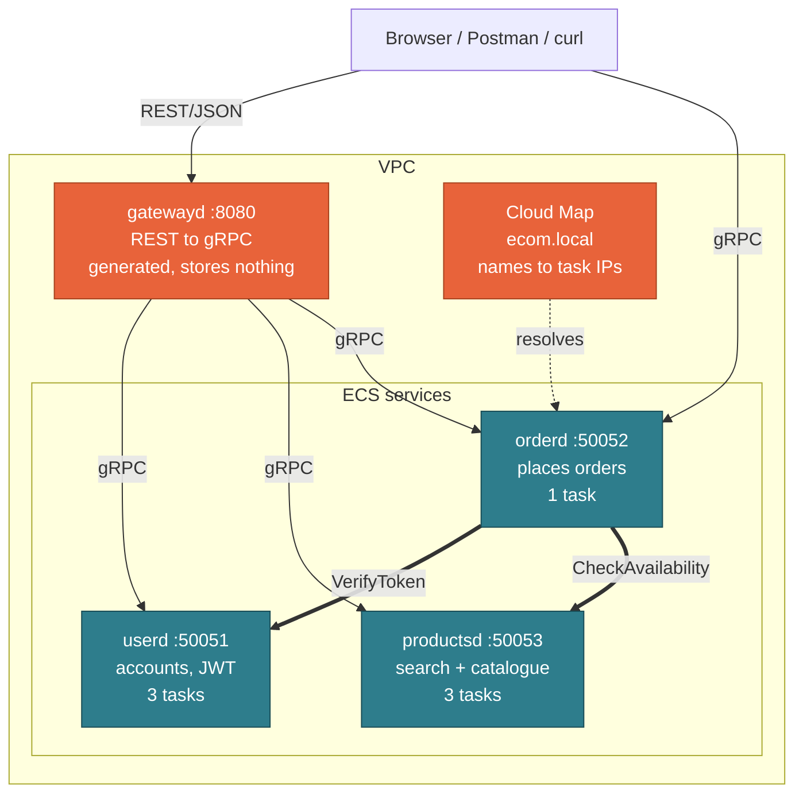

<!--
Plain markdown. Reads fine on GitHub as a document.
To project it:  npx @marp-team/marp-cli PRESENTATION.md -o slides.html

NOTE ON THE DIAGRAMS: the two Mermaid blocks render on GitHub. Marp does NOT
render Mermaid. Before projecting, open the GitHub view, screenshot each
diagram and drop the images in — or present those two slides from the GitHub
tab.

Speaker script is a SEPARATE file: PRESENTER.md

Every number here came out of a terminal in this repo, or from a source quoted
on the slide. Where something is a demo shortcut, the slide says so.
-->

# Running Go gRPC services on ECS

### From `localhost:50051` to production — with one set of Terraform modules

**Lakhan Samani** · AWS Community Day, Vadodara

`github.com/lakhansamani/grpc-ecs-demo`

---

## Where we are going

| Part | What you get |
|---|---|
| **1 · The use case** | Why this is three services and not one |
| **2 · Why gRPC** | What it is, what is actually true about it, when *not* to use it |
| **3 · Feeding a browser** | Do we need REST? Do we need a gateway? |
| **4 · Where it runs** | Lambda, EC2, EKS, ECS — and what Fargate really gives you |
| **5 · The code** | One contract → three services |
| **6 · The Terraform** | **Every AWS component, and one pipeline for laptop and prod** |
| **7 · Running it** | Three demos |

Parts 1–3 need no prior gRPC knowledge. **Part 6 is the heart of the talk.**

---

# Part 1 · The use case

## It is sale season

Big Billion Days. Great Indian Festival. Whichever one is running right now —
the sale you and I both have a tab open for.

Midnight. The banner goes live.

Everyone opens the app **at the same time**.

---

## What everyone is actually doing

| What they do | How often | Does it write anything? |
|---|---|---|
| Search "headphones under 2000" | Constantly | **No** |
| Scroll, compare, open a product page | Constantly | **No** |
| Add to cart, then go look at one more thing | Very often | No |
| **Actually place the order** | Far less often | **Yes** |

Most of a sale is **people looking**. A small slice is **people buying**.

You know this from your own behaviour: how many things did you open last sale,
and how many did you actually buy?

---

## Suppose the store is one application

One deployment: search, product pages, login, cart, checkout.

Traffic multiplies, so you scale up. More copies of the whole thing.

**And it works.** This is not a story about a bad decision.

It is a story about **what it costs you**:

- You are scaling **checkout** in order to survive **search** traffic
- A slow catalogue query and a checkout bug share one deploy, one rollback and
  one on-call page
- You cannot tune them separately, because they are the same process

---

## The overall picture



Two paths through one system. **They do not grow at the same rate.**

---

## So: three services

| Service | Job | Copies |
|---|---|---|
| `userd` | Accounts, login, tokens | **3** |
| `productsd` | Search, list, product pages | **3** |
| `orderd` | Places orders | **1** |

**How do you know the boundary is right?** A test you can apply at work:

> Would these ever need a **different number of copies**, a **different deploy
> schedule**, or a **different on-call owner**?
>
> If the answer is no to all three — **it is one service.**

Here, search gets hammered at midnight and checkout does not. That is a yes.

**Each split costs you** a network hop, a new failure mode and another thing to
deploy. Three is what *this* use case pays for. If yours pays for two, build
two.

---

## But now they have to talk to each other

Placing one order needs two questions answered by **other services**:

1. `userd` — *who is this person?*
2. `productsd` — *what do these items cost, and are they in stock?*

Inside one application those were function calls. Now they cross a network.

**So: how should services call each other?**

---

# Part 2 · Why gRPC

## What gRPC is

**gRPC lets you call a function that lives on another machine, as if it were
local.**

You write the function down — name, inputs, outputs — in a file. A compiler
turns that file into real code for both sides.

```
RPC  =  Remote Procedure Call        (calling a function somewhere else)
g    =  gRPC Remote Procedure Calls  (yes, the acronym contains itself)
```

---

## The mental shift

**REST** makes you think about *resources* and *verbs*:

```
POST /v1/orders        { "items": [...] }
```
*"What is the right noun? POST or PUT? Which status code?"*

**gRPC** makes you think about *functions*:

```protobuf
rpc CreateOrder(CreateOrderRequest) returns (CreateOrderResponse);
```
*"What does it take? What does it give back?"*

Everything else — HTTP/2, binary encoding, code generation — is machinery
serving that one idea.

---

## You write the contract. A compiler writes the code.

This is the **only** hand-written interface code in the project:

```protobuf
service OrderService {
  rpc CreateOrder(CreateOrderRequest) returns (CreateOrderResponse);
}

message RequestedItem {
  string product_id = 1;
  int32  quantity   = 2;
}
```

`make proto` turns it into:

- Go **server** interfaces — forget an RPC and it **will not compile**
- Go **client** stubs · a **REST/JSON gateway** · an **OpenAPI** spec
- A **TypeScript** client

---

## Let me be honest about performance

You will read that gRPC is "faster". Here is the accurate version.

**Real advantages, by design:**

- **Binary Protobuf** instead of JSON — smaller payloads, cheaper to parse
- **One multiplexed HTTP/2 connection** instead of a connection per call
- **Headers are not re-sent** in full on every request

**But:**

- For most internal services the network and your database dominate. Encoding
  is rarely the bottleneck.
- I have **not** benchmarked it here, so I will not put a speed-up number on a
  slide.

> Performance is a genuine benefit. It is just **not usually why teams switch**
> — and it is not something I can prove to you today.

---

## What I *can* prove: streaming is not the point

I counted the RPCs in the real `.proto` files of 14 well-known projects:

| | RPCs | Use streaming |
|---|---|---|
| Temporal | 121 | **0** |
| Milvus | 154 | 2 |
| Qdrant | 30 | **0** |
| containerd | 17 | **0** |
| OpenTelemetry (OTLP) | 1 | **0** |
| Envoy xDS | 2 | **2** (100%) |
| **All 14 together** | **611** | **50 — about 8%** |

Protos are in `docs/evidence/`. The counts reproduce with one `grep` — please
check them.

**So:** streaming is a specialist tool, not the reason to adopt gRPC. And **not
one** of these 14 exposes gRPC to the public internet. What you are most likely
adopting is a **typed, versioned contract between your own services**.

---

## When gRPC, and when REST

| Use gRPC when | Use REST when |
|---|---|
| Services call **each other**, inside your network | A **browser** is the client |
| You want one contract in several languages | A third party integrates with you |
| Breaking a field should fail **CI**, not production | `curl` and a browser tab must just work |
| The call is a **function** | Public, cacheable, bookmarkable URLs |

**Usually you need both.** It is a question of *where*, not of which is better.

---

# Part 3 · Feeding a browser

## A browser cannot speak gRPC

Not a configuration problem. A browser cannot open a raw HTTP/2 connection and
control trailers the way gRPC requires.

So something has to translate. **Three real options:**

| Option | What it means | Cost |
|---|---|---|
| **1 · A gateway process** | One service translates REST→gRPC for everything behind it | One more thing to deploy and scale |
| **2 · Gateway in-process** | Each service serves gRPC *and* REST on its own ports | No extra hop; every service carries an HTTP stack |
| **3 · ConnectRPC** | The server speaks Connect, gRPC **and** gRPC-Web on **one port** | A different server library |

Connect's own docs say it interops *"with `grpc-web` frontends without the need
for an intermediary proxy (such as Envoy)."*

---

## So do we actually need `gatewayd`?

**No. It is a choice — here is the honest trade-off.**

I picked option 1 because it makes the lesson **visible**: `gatewayd` is a
separate ECS service with its own task definition, so you watch a stateless
service deploy next to stateful ones.

**If I were starting a product today**, option 3 is very attractive: one port,
no extra hop, nothing extra to operate, and the browser talks to your service
directly. The TypeScript client in this repo already uses
`@connectrpc/connect`.

**When a gateway process still earns its place:**

- You want **one** public door to audit, rate-limit and put a WAF in front of
- Your services must stay plain gRPC, because another team owns them
- You need request shaping that does not belong inside any one service

---

## And no — not every RPC needs REST

Of the 10 RPCs in this repo, **9 have a REST route. One does not.**

```protobuf
// NOTE: deliberately NO google.api.http option.
rpc CheckAvailability(CheckAvailabilityRequest) returns (CheckAvailabilityResponse);
```

| | |
|---|---|
| **Gets REST** | The 9 a browser genuinely calls — register, login, me, list/get/search products, create/get/list orders |
| **Does not** | `CheckAvailability`. `orderd` calls it to price a cart. **Nothing outside should.** |

```
REST  -> 404
gRPC  -> works
```

**The rule:** a REST route exists for a client you do **not** control. Expose
exactly those. Four lines of annotation are the entire difference.

---

# Part 4 · Where does it run?

## Four options. One is ruled out by mechanics, not taste.

| Option | Can it serve gRPC? | What you operate |
|---|---|---|
| **Lambda** | **No** | Nothing |
| **EC2** | Yes | AMIs, patching, scaling groups, your own deploys |
| **EKS** (Kubernetes) | Yes, very well | Control plane, nodes, upgrades, CNI, ingress, RBAC |
| **ECS + Fargate** | Yes | A task definition and a service. **Chosen.** |

gRPC needs a **process that stays listening**, holding an HTTP/2 connection.
Lambda has none. From the AWS load balancer docs on gRPC target groups,
**verbatim**:

> "The only supported target types are `instance` and `ip`."
> "**You can't use Lambda functions as targets.**"

---

## Why ECS *for now* — and when to leave

The real question is not "serverless or containers?" It is **how much
orchestration do four services actually need?**

- Four services = four task definitions. That is the whole requirement.
- An ECS **task role is just an IAM role** — nothing new to learn first.

**Kubernetes is genuinely excellent at this.** Move when you have dozens of
services and several teams, need a real service mesh, or the same manifests
must run on-prem too.

> Moving later is **not a rewrite.** The container, the contract, the health
> check and the graceful shutdown all come with you. Only the YAML changes.

---

## What Fargate actually gives you — and what it does not

**Fargate = run containers without managing EC2 instances.** AWS's words: *"you
no longer have to provision, configure, or scale clusters of virtual
machines."*

**AWS owns** the *platform version*, which AWS defines as *"a combination of
the kernel and container runtime versions."*

**And here is the part people miss:**

> "If a security issue is found that affects an existing platform version, AWS
> creates a new patched revision of the platform version **and retires tasks
> running on the vulnerable revision.**"

**AWS will stop your task to patch underneath you.** A task never upgrades in
place — a *new* task gets the new revision.

**You still own** everything **inside** your image: your base image, your
packages, your CVEs. *Serverless does not mean nobody patches.*

> Which is why graceful shutdown is not optional. Your task **will** be
> replaced on someone else's schedule.

---

## Three words for the rest of this talk

| Word | What it means |
|---|---|
| **Task** | One running container with its own private IP. "One copy of your service." |
| **Task definition** | The recipe: image, CPU, memory, ports, secrets, health check. Versioned — editing it creates **revision 2**; revision 1 never changes. |
| **Service** | The controller that keeps *N* tasks of a task definition running and replaces the ones that die. |

---

# Part 5 · The code

## Three services, one contract



One set of `.proto` files generates the Go servers, the Go clients, `gatewayd`,
the OpenAPI spec and the TypeScript client.

---

## One order, end to end

```
POST /v1/orders  { items: [{productId, quantity}], idempotencyKey }
        |
        v
   gatewayd ──gRPC──> orderd.CreateOrder
                         |
                         ├──> userd.VerifyToken            who is this?
                         |      <── User{id, name}
                         |
                         ├──> productsd.CheckAvailability   price + stock
                         |      <── per-item price, stock
                         |
                         ├─ total computed from CATALOGUE prices
                         └─ persist, return Order{CONFIRMED, total}
```

Two outbound hops on the write path. **Both gRPC. Neither public.**

---

## Two contract decisions worth arguing about

**1 · The order request carries no price.**

```protobuf
message RequestedItem { string product_id = 1; int32 quantity = 2; }
```

The client sends *what* and *how many*. `orderd` asks `productsd` what it
costs.

Think about the alternative during a sale: if the client sends the price, a
client can ask *"is this ₹2,000 sale price real?"* and then submit ₹200.

**2 · "Out of stock" is not an error.**

```
CreateOrder → OK, status = REJECTED, reason = OUT_OF_STOCK
```

Not `codes.Internal`. Not a 500. Status codes stay for *unauthenticated*,
*invalid argument*, *unavailable*. Business outcomes are an **enum** in the
response, so clients branch on a value — never on an error string.

> `if strings.Contains(err.Error(), "stock")` means a reworded message breaks
> production.

---

## One honest note on copies

`userd` and `productsd` run 3 copies because their database is **baked into the
image** — every copy is identical, so any copy can answer any read.

`orderd` runs **1**, and I want to be precise about why:

> Not "because it writes". **Because it writes to a file inside the task.**
> Three copies would be three different databases.

**Give it a managed database and `orderd` scales like the others.** SQLite on
the task is a demo shortcut that keeps the AWS deploy at ~2 minutes instead of
~10. Terraform refuses to scale it, so the shortcut cannot bite by accident:

```sh
make show-guard
```

---

# Part 6 · The Terraform

## Six modules, four services, two environments

```
terraform/
├── modules/
│   ├── network/        VPC, subnets, IGW, routes, security group
│   ├── ecr/            one image repository
│   ├── ecs-cluster/    cluster + capacity providers + Cloud Map + log group
│   ├── iam/            execution role, task role
│   ├── secrets/        the shared JWT secret
│   └── ecs-service/    task definition + service + Cloud Map registration
│
├── stack/              THE WHOLE DEPLOYMENT — shared verbatim
│   └── main.tf         wires the modules; instantiates ecs-service x4
│
└── envs/
    ├── local/          provider.tf  <- the only difference
    └── aws/            provider.tf  <- the only difference
```

`ecs-service` is instantiated **four times**. `protocol = "grpc" | "http"`
switches the port mapping and which mode the baked-in health probe uses.

---

## Every AWS component this creates

| Component | Resource | Why it is here |
|---|---|---|
| **VPC** | `aws_vpc` | Private network. `enable_dns_hostnames` is **required** for Cloud Map. |
| **Subnets** ×2 | `aws_subnet` | Two availability zones. |
| **Internet Gateway** | `aws_internet_gateway` | Tasks reach ECR, Secrets Manager, CloudWatch. |
| **Route table** | `aws_route_table` + assoc | `0.0.0.0/0` → IGW. |
| **Security group** | `aws_security_group` + 3 rules | A **self-referencing** rule is how `orderd` reaches the others — no CIDRs to maintain. |
| **ECR** ×4 | `aws_ecr_repository` | Private registry. `force_delete`, so `destroy` is never blocked. |
| **ECS cluster** | `aws_ecs_cluster` | The namespace the services live in. |
| **Capacity providers** | `aws_ecs_cluster_capacity_providers` | `FARGATE` + `FARGATE_SPOT`. |
| **Cloud Map namespace** | `aws_service_discovery_private_dns_namespace` | Creates `ecom.local` as a **Route 53 private hosted zone**. |
| **Cloud Map service** ×4 | `aws_service_discovery_service` | A records appear and vanish as tasks come and go. |
| **Log group** | `aws_cloudwatch_log_group` | `/ecs/<name>`, 1-day retention. |
| **Execution role** | `aws_iam_role` | The **agent** uses it: pull image, read secret, create log streams. |
| **Task role** | `aws_iam_role` | **Your process's** credentials. Deliberately **empty**. |
| **Secret** | `aws_secretsmanager_secret` + version | The shared `JWT_SECRET`. |
| **Task definition** ×4 | `aws_ecs_task_definition` | The recipe. |
| **ECS service** ×4 | `aws_ecs_service` | Keeps N tasks alive. |

**22 resource types. No NAT Gateway, no ALB, no RDS** — each one deliberate.

---

## The two IAM roles, because people conflate them

| Role | Who uses it | When |
|---|---|---|
| **Execution role** | the **ECS agent** | **Before** your code runs: pull the image, resolve secrets, create log streams |
| **Task role** | **your process** | At runtime. The AWS SDK picks it up by itself. |

Get this wrong and your task fails to start with an error pointing at the wrong
role.

Here the **task role is empty on purpose** — these services call no AWS API at
runtime. Nothing is granted "just in case".

```sh
docker inspect <task> | grep AWS_CONTAINER_CREDENTIALS
# AWS_CONTAINER_CREDENTIALS_FULL_URI=http://.../v2/credentials/46e1d1eb-...
```

That one variable is the whole "no API keys on ECS" story. **You never created
a key, so there is none to leak.**

---

## Cloud Map is just DNS — and that matters

`orderd` knows no IP addresses. It dials a **name**:

```
userd.ecom.local:50051
```

ECS registers each task's IP with Cloud Map; Cloud Map maintains the A records
in a Route 53 private hosted zone. Tasks come and go; the name does not.

```hcl
routing_policy = "MULTIVALUE"          # return EVERY healthy task
dns_records { type = "A"  ttl = 10 }   # low TTL, so scale-out is seen fast
health_check_custom_config { failure_threshold = 1 }
```

> That last block looks like dead weight. **Removing it broke everything.** An
> *empty* block makes the provider send no health config at all, so Cloud Map
> never accepts ECS's health reports, every instance stays UNHEALTHY — and
> unhealthy instances are **excluded from DNS**. Four tasks running, zero
> addresses returned. The comment in that file now says, in capitals, do not
> clean it up.

---

## One pipeline. Laptop and production.

```sh
diff terraform/envs/local/provider.tf terraform/envs/aws/provider.tf
```

**That diff is the whole talk.**

```hcl
# envs/local/provider.tf                 # envs/aws/provider.tf
provider "aws" {                         provider "aws" {
  access_key = "test"                      region = var.aws_region
  secret_key = "test"                    }
  region     = "us-east-1"
  skip_credentials_validation = true
  ...
  endpoints {                            # (nothing else)
    ecs = "http://localhost:4566"
    ecr = "http://localhost:4566"
    ...
  }
}
```

Everything describing the deployment lives in `terraform/stack/` and is shared
**verbatim**. Not a copy. Not a simplified local version. **The same files.**

> That is the argument for emulating locally instead of keeping a second set of
> local manifests: **there is no second set to drift.**

---

## How the laptop part works — and where it is honest

**Ministack** (MIT) emulates ECS by launching **real Docker containers**, plus
ECR, Cloud Map, Secrets Manager and SSM. LocalStack's free Community edition
ended 2026-03-23, and ECS was never in it.

**Real locally:** the Terraform, the task definitions, `awsvpc` networking,
secret injection, health checks, graceful shutdown, metrics, traces.

**Where I substitute — and say so on stage:**

| Gap | Stand-in |
|---|---|
| Cloud Map stores registrations but serves **no DNS** | `make dns` adds Docker network aliases. Legitimate, because **service discovery is only DNS underneath.** |
| `awsvpc` tasks have **no host port** | `make forward` runs a relay. On AWS this is SSM port forwarding. |
| `healthStatus` / `launchType` not echoed back | Real ECS reports `HEALTHY` / `FARGATE`. |

> Naming the emulator's limits yourself is more credible than being caught by
> them — and it is exactly why this also deploys to real AWS.

---

# Part 7 · Running it

## Demo 1 — Is this really ECS, or just docker compose?

```sh
make ps
```

Seven escalating proofs. Two of them settle it.

**The task describes itself** — nothing in our code sets this:

```
ECS_CONTAINER_METADATA_URI_V4=http://.../v4/Iw-s54...
  Cluster : arn:aws:ecs:us-east-1:...:cluster/ecom-local
  Family  : userd rev 1
```

**And credentials arrive with no key existing anywhere:**

```
AWS_CONTAINER_CREDENTIALS_FULL_URI=http://.../v2/credentials/46e1d1eb-...
```

---

## Demo 2 — The code, running

```sh
make demo        # over gRPC
make dev-rest    # the same flow over REST
```

```
search  -> Wireless Noise Cancelling Headphones, Noise Cancelling Earbuds Ultra
login   -> token acquired
order   -> ORDER_STATUS_CONFIRMED  total=36997.0 INR  (2 lines priced by productsd)
replay  -> same order returned (replay=True)
reject  -> ORDER_STATUS_REJECTED | REJECTION_REASON_OUT_OF_STOCK
no token-> Unauthenticated, as expected
```

Then the internal RPC, two ways:

```
REST  -> 404        gRPC  -> works
```

And the same flow from **generated TypeScript**: `make ts-demo`

---

## Demo 3 — The same Terraform, against real AWS

```sh
cd terraform/envs/aws
terraform plan      # same modules. no endpoints block.
terraform apply     # ~2 minutes
make ps-aws
```

What changed between laptop and AWS: **one provider block.**

What is real now that was substituted before:

- **Cloud Map does the DNS for real** — no alias shim
- `healthStatus: HEALTHY`, `launchType: FARGATE`
- Tasks spread across **two availability zones**

```sh
terraform destroy   # before leaving the venue
```

---

## One thing to know before you ship gRPC on ECS

Not a demo — just the most useful thing I learned building this.

**gRPC's default load-balancing policy is `pick_first`.** It resolves the name,
connects to **one** address, and sends everything down that connection.

So you scale to three tasks and **one task can take all the traffic.** Nothing
warns you: no error, no log line, no failed health check. Measured here:
**120 of 120 requests landed on one task.**

The fix is two settings, and **either alone does nothing**:

```go
grpc.NewClient("dns:///userd.ecom.local:50051",      // <- dns:/// matters
    grpc.WithDefaultServiceConfig(
        `{"loadBalancingConfig":[{"round_robin":{}}]}`))
```

A bare `host:port` uses the *passthrough* resolver and yields exactly **one**
address — so `round_robin` has nothing to balance over. Plus `MaxConnectionAge`
on the server, so clients re-resolve after a scale-out.

With both: **40 / 40 / 40.**

---

## What to take away

1. **Draw boundaries where the copies, deploys or owners differ.** Otherwise it
   is one service.
2. **Adopt gRPC for the contract.** The performance is a bonus you probably
   will not measure.
3. **Expose REST only where you do not control the client** — 9 of our 10 RPCs,
   not all of them.
4. **A gateway is a choice, not a requirement.** ConnectRPC gives you one port
   and no gateway at all.
5. **Fargate does not mean nobody patches.** AWS patches the platform *and
   retires your tasks to do it.* You still own your image.
6. **One Terraform stack, two provider blocks.** There is no second set of
   manifests to drift.
7. **`pick_first` is the default.** Three tasks and one gets everything is the
   *normal* outcome.

---

## Clone it and run it

### `github.com/lakhansamani/grpc-ecs-demo`

```sh
make test          # no Docker, no AWS needed
make local-up      # real ECS tasks on your laptop
make ps            # prove it is really ECS
make demo          # the whole flow
```

- `docs/ARCHITECTURE.md` — every AWS component: what, why, how
- `docs/DEMO_GUIDE.md` — every command, and how to inspect each component
- `SPEC.md` — every decision, marked verified or assumed

**Thank you. Questions?**
