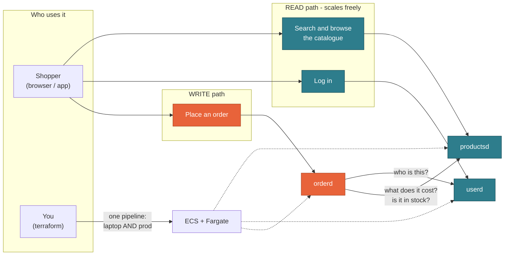
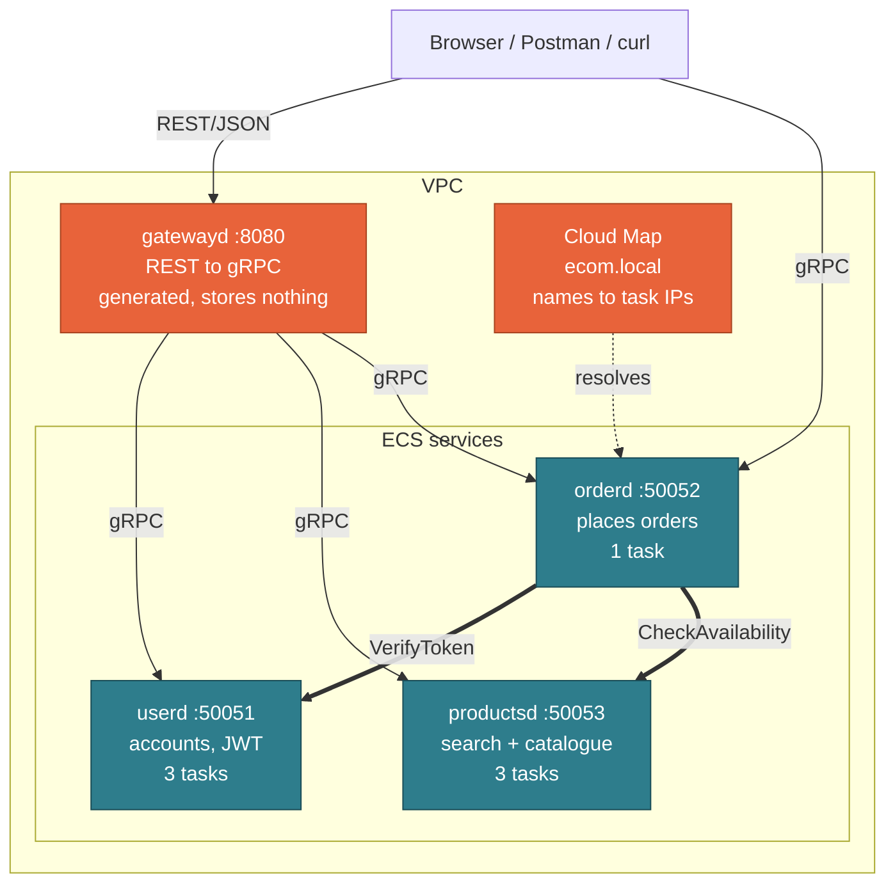

<!--
Plain markdown. Reads fine on GitHub as a document.
To project it:  npx @marp-team/marp-cli PRESENTATION.md -o slides.html

DIAGRAMS: the two Mermaid blocks render on GitHub. Marp does NOT render
Mermaid. Either present slides 6 and 25 from the GitHub tab, or screenshot
them and paste the images in. Decide before you are on stage.

Slides marked [ASK] are audience-prediction beats — do not read the next
slide until someone has answered. Slides marked [BEAT] are single-line pace
changes; they take ten seconds.

Speaker script is a SEPARATE file: PRESENTER.md

Every number here came out of a terminal in this repo, or from a source quoted
on the slide. Where something is a shortcut, the slide says so.
-->

# Running Go gRPC services on ECS

### From `localhost:50051` to production — with one set of Terraform modules

**Lakhan Samani** · AWS Community Day, Vadodara

`github.com/lakhansamani/grpc-ecs-demo`

---

## What you will leave with

1. **Why a gRPC service cannot run on Lambda** — and what that rules out.
2. **How to run one set of Terraform against a laptop and against AWS**,
   differing by a single provider block.
3. **The default that catches almost everyone:** gRPC's standard client sends
   every request to *one* server, even when three healthy ones are registered
   and DNS returns all three. Nothing warns you. We will cover what it is and
   how to fix it.

Everything is in the repo, and every number in these slides came out of a
terminal there.

---

## Where we are going

| Part | What you get |
|---|---|
| **1 · The use case** | Why this is three services and not one |
| **2 · Why gRPC** | What it is, what is actually true about it, when *not* to use it |
| **3 · Feeding a browser** | Do we need REST? Do we need a gateway? |
| **4 · Where it runs** | Lambda, EC2, EKS, ECS — and what Fargate really gives you |
| **5 · The code** | One contract → three services |
| **6 · The Terraform** | **Every AWS component, and one pipeline for laptop and prod** |
| **7 · Running it** | Three demos, then that bug |

Parts 1–3 need no prior gRPC knowledge. **Part 6 is the heart of the talk.**

---

# Part 1 · The use case

## It is sale season

Big Billion Days. Great Indian Festival. Whichever one is running right now —
the sale you and I both have a tab open for.

Midnight. The banner goes live.

Everyone opens the app **at the same time**.

---

## [ASK] Think about your own last sale

> **How many products did you open?**
>
> **How many did you buy?**

Hold that ratio in your head. We are about to build the architecture it
implies.

---

## That ratio, as a table

| What they do | How often | Does it write anything? |
|---|---|---|
| Search "headphones under 2000" | Constantly | **No** |
| Scroll, compare, open a product page | Constantly | **No** |
| Add to cart, then go look at one more thing | Very often | No |
| **Actually place the order** | Far less often | **Yes** |

Most of a sale is **people looking**. A small slice is **people buying**.

I am not going to put somebody else's traffic graph on a slide. **Your own
browsing is the evidence**, and it is better evidence, because you trust it.

---

## Suppose the store is one application

One deployment: search, product pages, login, cart, checkout.

Traffic multiplies, so you scale up. More copies of the whole thing.

**And it works.** This is not a story about a bad decision.

It is a story about **what it costs you**:

- You are scaling **checkout** in order to survive **search** traffic
- A slow catalogue query and a checkout bug share one deploy, one rollback and
  one on-call page
- You cannot tune them separately, because they are the same process

---

## [BEAT]

# Two workloads.
# One deploy button.

---

## The overall picture



Teal reads. Orange writes. **They do not grow at the same rate.**

---

## So: three services

| Service | Job | Copies |
|---|---|---|
| `userd` | Accounts, login, tokens | **3** |
| `productsd` | Search, list, product pages | **3** |
| `orderd` | Places orders | **1** |

**How do you know the boundary is right?** A test you can use at work tomorrow:

> Would these ever need a **different number of copies**, a **different deploy
> schedule**, or a **different on-call owner**?
>
> **No to all three → it is one service.** Put it back.

Here, search gets hammered at midnight and checkout does not. That is a yes.

**Each split costs you** a network hop, a new failure mode and another thing to
deploy. Three is what *this* use case pays for. If yours pays for two, build
two.

---

## But now they have to talk to each other

Placing one order needs two questions answered by **other services**:

1. `userd` — *who is this person?*
2. `productsd` — *what do these items cost, and are they in stock?*

Inside one application those were function calls. Now they cross a network.

**So: how should services call each other?**

---

# Part 2 · Why gRPC

## What gRPC is

**gRPC lets you call a function that lives on another machine, as if it were
local.**

You write the function down — name, inputs, outputs — in a file. A compiler
turns that file into real code for both sides.

```
RPC  =  Remote Procedure Call        (calling a function somewhere else)
g    =  gRPC Remote Procedure Calls  (yes, the acronym contains itself)
```

---

## The mental shift

**REST** makes you think about *resources* and *verbs*:

```
POST /v1/orders        { "items": [...] }
```
*"What is the right noun? POST or PUT? Which status code?"*

**gRPC** makes you think about *functions*:

```protobuf
rpc CreateOrder(CreateOrderRequest) returns (CreateOrderResponse);
```
*"What does it take? What does it give back?"*

Everything else — HTTP/2, binary encoding, code generation — is machinery
serving that one idea.

---

## You write the contract. A compiler writes the code.

This is the **only** hand-written interface code in the project:

```protobuf
service OrderService {
  rpc CreateOrder(CreateOrderRequest) returns (CreateOrderResponse);
}

message RequestedItem {
  string product_id = 1;
  int32  quantity   = 2;
}
```

`make proto` turns it into:

- Go **server** interfaces — forget an RPC and it **will not compile**
- Go **client** stubs · a **REST/JSON gateway** · an **OpenAPI** spec
- A **TypeScript** client

> Nobody should write a client from a wiki page that was last accurate four
> months ago.

> **Show:** `proto/order/v1/order.proto` → then `buf.gen.yaml` → then
> `gen/go/order/v1/order_grpc.pb.go` (scroll, do not read) and
> `gen/openapi/api.swagger.json`

---

## Let me be honest about performance

You will read that gRPC is "faster". Here is the accurate version.

**Real advantages, by design:**

- **Binary Protobuf** instead of JSON — smaller payloads, cheaper to parse
- **One multiplexed HTTP/2 connection** instead of a connection per call
- **Headers are not re-sent** in full on every request

**But:**

- For most internal services the network and your database dominate. Encoding
  is rarely the bottleneck.
- I have **not** benchmarked this repo, so I will not put a speed-up number on
  a slide and have you quote me on it.

> Performance is a genuine benefit. It is just **not usually why teams switch**.

---

## [ASK] So people say gRPC is for streaming

I counted every RPC in the real `.proto` files of **14 projects you have heard
of** — Temporal, etcd, containerd, Kubernetes CRI, Milvus, Qdrant, TiKV, Dapr,
CockroachDB, Vitess, Thanos, Bazel, Envoy, OpenTelemetry.

**611 RPCs in total.**

> ### What percentage use streaming?
>
> Shout out a number.

---

## About 8%

| | RPCs | Use streaming |
|---|---|---|
| Temporal | 121 | **0** |
| Milvus | 154 | 2 |
| Qdrant | 30 | **0** |
| containerd | 17 | **0** |
| OpenTelemetry (OTLP) | 1 | **0** |
| Envoy xDS | 2 | **2** (100%) |
| **All 14 together** | **611** | **50 — about 8%** |

Protos are in `docs/evidence/`. The counts reproduce with one `grep` — **please
go check me.**

> **Show:** `ls docs/evidence/` and one `grep -c '^  rpc ' docs/evidence/Temporal.proto`

**Two conclusions.** Streaming is a specialist tool, not the reason to adopt
gRPC. And **not one** of these 14 exposes gRPC to the public internet.

What you are most likely adopting is a **typed, versioned contract between your
own services**.

---

# Part 3 · Feeding a browser

## A browser cannot speak gRPC

Not a configuration problem. A browser cannot open a raw HTTP/2 connection and
control trailers the way gRPC requires.

gRPC is for the calls *inside* your network. The moment a client is a browser
or a third party, you need REST — so **usually you need both**, and the only
question is where the line sits.

So something has to translate. **Three real options:**

| Option | What it means | Cost |
|---|---|---|
| **1 · A gateway process** | One service translates REST→gRPC for everything behind it | One more thing to deploy and scale |
| **2 · Gateway in-process** | Each service serves gRPC *and* REST on its own ports | No extra hop; every service carries an HTTP stack |
| **3 · ConnectRPC** | The server speaks Connect, gRPC **and** gRPC-Web on **one port** | A different server library |

Connect's own docs say it interops *"with `grpc-web` frontends without the need
for an intermediary proxy (such as Envoy)."*

> **Show:** `cmd/gatewayd/main.go` — about 100 lines, and none of the routing is
> hand-written

---

## So do we actually need `gatewayd`?

# No.

It is a choice. Here is the honest trade-off.

**Why I picked option 1:** it makes the lesson *visible*. `gatewayd` is a
separate ECS service with its own task definition, so you watch a stateless
service deploy next to stateful ones.

**If I were starting a product today**, option 3 is very attractive: one port,
no extra hop, nothing extra to operate. The TypeScript client in this repo
already uses `@connectrpc/connect`.

**When a gateway process still earns its keep:**

- You want **one** public door to audit, rate-limit and put a WAF in front of
- Your services must stay plain gRPC, because another team owns them

---

## And do we need REST for every API?

# Also no.

Of the 10 RPCs in this repo, **9 have a REST route. One does not.**

```protobuf
// NOTE: deliberately NO google.api.http option.
rpc CheckAvailability(CheckAvailabilityRequest) returns (CheckAvailabilityResponse);
```

`orderd` calls `CheckAvailability` to price a cart. **Nothing outside should.**

```
REST  -> 404
gRPC  -> works
```

> **Show:** `proto/product/v1/product.proto` — the four annotated RPCs, then the
> un-annotated one with its comment

So the proto itself is the access-control decision, and you can read it in a
code review.

**One nuance worth seeing:** `VerifyToken` is *both*. It is
`GET /v1/users/me` for the browser **and** the internal hop `orderd` makes on
every order. Same RPC, same implementation, two callers — which is fine. The
annotation decides who can *reach* it, not who it is *for*.

> **The rule:** a REST route exists for a client you do **not** control. Expose
> exactly those. Four lines of annotation are the entire difference between an
> internal and a public API.

---

# Part 4 · Where does it run?

## Four options. One is ruled out by mechanics, not taste.

| Option | Can it serve gRPC? | What you operate |
|---|---|---|
| **Lambda** | **No** | Nothing |
| **EC2** | Yes | AMIs, patching, scaling groups, your own deploys |
| **EKS** (Kubernetes) | Yes, very well | Control plane, nodes, upgrades, CNI, ingress, RBAC |
| **ECS + Fargate** | Yes | A task definition and a service. **Chosen.** |

gRPC needs a **process that stays listening**, holding an HTTP/2 connection.
Lambda has none. From the AWS load balancer docs on gRPC target groups,
**word for word**:

> "The only supported target types are `instance` and `ip`."
> "**You can't use Lambda functions as targets.**"

---

## Why ECS *for now* — and when to leave

The real question is not "serverless or containers?" It is **how much
orchestration do four services actually need?**

- Four services = four task definitions. That is the whole requirement.
- An ECS **task role is just an IAM role** — nothing new to learn first.

**Kubernetes is genuinely excellent at this.** Move when you have dozens of
services and several teams, need a real service mesh, or the same manifests
must run on-prem too.

> Moving later is **not a rewrite.** The container, the contract, the health
> check and the graceful shutdown all come with you. Only the YAML changes.
>
> *"For now"* is a legitimate engineering answer. *"Forever"* rarely is.

---

## [ASK] A question about Fargate

Your container is running on Fargate. There is a kernel underneath it.

> ### Who patches that kernel?
>
> And — **what happens to your running task when they do?**

---

## What Fargate actually gives you — and what it does not

**Fargate = run containers without managing EC2 instances.** AWS's words: *"you
no longer have to provision, configure, or scale clusters of virtual
machines."*

**AWS owns** the *platform version*, which AWS defines as *"a combination of
the kernel and container runtime versions."* So AWS patches it. But:

> "If a security issue is found that affects an existing platform version, AWS
> creates a new patched revision of the platform version **and retires tasks
> running on the vulnerable revision.**"

**AWS will stop your task to patch underneath you.** A task never upgrades in
place — a *new* task gets the new revision.

**And you still own** everything **inside** your image: your base image, your
packages, your CVEs.

> **Show:** `terraform/modules/ecs-service/main.tf` — `runtime_platform`,
> `requires_compatibilities`, `stopTimeout`

> **Serverless does not mean nobody patches.** It means AWS patches their half,
> kills your task to do it, and you still patch yours.
>
> Which is why graceful shutdown is not optional. Remember that.

---

## How health checks are actually wired here

**What:** the same question — *is this task alive?* — asked at **four**
independent layers.

```
 1. YOUR CODE      grpc.health.v1.Health          registered in grpcserver
 2. THE CONTAINER  task definition healthCheck -> /healthcheck binary
 3. SERVICE DISCOVERY  Cloud Map takes ECS's verdict -> DNS answers or not
 4. (production)   ALB target group -> /pkg.Service/Method
```

**Why four?** Because each one controls something different:

| Layer | If it says unhealthy |
|---|---|
| **1 · app** | callers and every layer below learn something is wrong |
| **2 · container** | **ECS replaces the task** |
| **3 · Cloud Map** | the task is **removed from DNS**, so no new client reaches it |
| **4 · ALB** | the target stops receiving requests |

**How:**

```go
// 1. in grpcserver — and only AFTER everything is wired up
hs := health.NewServer()
healthpb.RegisterHealthServer(s, hs)
hs.SetServingStatus(serviceName, healthpb.HealthCheckResponse_SERVING)
```

```hcl
# 2. in the task definition. The image is DISTROLESS - no shell, no curl, no
# grpc-health-probe - so a tiny Go binary is baked in instead.
healthCheck = {
  command     = ["CMD", "/healthcheck", "-addr", "localhost:50051", "-service", "userd"]
  interval    = 10
  retries     = 3
  startPeriod = 10
}
```

`gatewayd` serves HTTP, not gRPC, so the same binary takes `-http
http://localhost:8080/healthz`. One `protocol` variable in the module picks
which.

> **Show:** `cmd/healthcheck/main.go` — 80 lines, and note it dials
> `passthrough:///`. This probe must hit **its own container**, so DNS
> resolution and load balancing would be actively wrong here.

---

## The health check is also how you shut down cleanly

On `SIGTERM`, the **order** matters, and it is the opposite of what feels
natural:

```go
// 1. fail health checks FIRST - stop being given new work
hs.SetServingStatus(name, healthpb.HealthCheckResponse_NOT_SERVING)
hs.Shutdown()

// 2. THEN drain in-flight RPCs
GracefulStop()      // bounded by SHUTDOWN_TIMEOUT

// 3. hard stop as a backstop
Stop()
```

Flip 1 and 2 and you keep accepting new requests while trying to drain.

And the two timeouts have to agree:

```
stopTimeout      = 30   # ECS: how long it waits before SIGKILL
SHUTDOWN_TIMEOUT = 15s  # the app: how long it drains
```

> If `stopTimeout` is **shorter** than your drain, ECS kills you mid-drain and
> every line of graceful-shutdown code you wrote did nothing.
>
> Remember slide 24: AWS **retires your task** to patch the platform. This is
> the code path that makes that a non-event.

---

## Three words for the rest of this talk

| Word | What it means |
|---|---|
| **Task** | One running container with its own private IP. "One copy of your service." |
| **Task definition** | The recipe: image, CPU, memory, ports, secrets, health check. Versioned — editing it creates **revision 2**; revision 1 never changes. |
| **Service** | The controller that keeps *N* tasks of a task definition running and replaces the ones that die. |

---

# Part 5 · The code

## Three services, one contract



**Nobody in this diagram knows anybody's IP address.** They dial names.

> **Show:** `internal/order/service.go` — `CreateOrder`, the two hops, and the
> total computed from catalogue prices

---

## The request has no price in it

```protobuf
message RequestedItem { string product_id = 1; int32 quantity = 2; }
```

The client sends *what* and *how many*. `orderd` asks `productsd` what it
costs.

**Think about the alternative during a sale.** If the client sends the price,
then a client can ask *"is this ₹2,000 sale price real?"* — and then submit
₹200.

---

## [ASK] You tap "Buy". The spinner spins.

Midnight, sale traffic, patchy 4G. Your phone sends the order and the response
never comes back.

So your phone retries. Reasonably — it has no idea whether the server got it.

> ### Did you just buy one phone, or two?

---

## That is what an idempotency key is for

The client makes up a unique string per *intent to buy* and sends it with the
order:

```protobuf
message CreateOrderRequest {
  repeated RequestedItem items  = 1;
  string idempotency_key        = 2;   // required
}
```

**The server's deal:** *"Send me the same key twice and you get the same order
back — I will not create a second one."*

```
first call   -> Order abc123, idempotentReplay = false
same key     -> Order abc123, idempotentReplay = true    <- no second order
```

> **Show:** `internal/order/service.go` — the pre-check, then the
> `gorm.ErrDuplicatedKey` fallback

Three details that matter in the code:

- **Required.** No key → `InvalidArgument`. A retry-unsafe order API is a bug.
- **Namespaced per user** (`userID + ":" + key`), so two shoppers cannot
  collide on `"cart-1"`.
- **A unique index backs it**, not just an `if`. Two simultaneous retries race;
  one loses, catches the duplicate-key error, and returns the stored order.

> The check alone is not enough. **The database constraint is what makes it
> true.**

---

## And "out of stock" is not an error

```
CreateOrder → OK, status = REJECTED, reason = OUT_OF_STOCK
```

Not `codes.Internal`. Not a 500.

gRPC status codes stay for what they are for: *unauthenticated*, *invalid
argument*, *unavailable*. Business outcomes are an **enum** in the response, so
clients branch on a value — never on an error string.

> `if strings.Contains(err.Error(), "stock")` means that somebody rephrasing a
> message breaks production.
>
> **An enum cannot be rephrased.**

---

## One honest note on copies

`userd` and `productsd` run 3 copies because their database is **baked into the
image** — every copy is identical, so any copy can answer any read.

`orderd` runs **1**, and I want to be precise about why, because I used to say
this badly:

> **Not** "because it writes". Writers scale fine.
>
> **Because it writes to a file inside the task.** Three copies would be three
> different databases.

> **Show:** `build/Dockerfile.seeded` vs `build/Dockerfile.stateful` — one per
> storage shape, not per service

**Give it a managed database and `orderd` scales like the others.** SQLite on
the task is a demo shortcut that keeps the AWS deploy at ~2 minutes instead of
~10. Terraform refuses to scale it, so the shortcut cannot bite by accident:

```sh
make show-guard
```

---

# Part 6 · The Terraform

## Six modules, four services, two environments

```
terraform/
├── modules/
│   ├── network/        VPC, subnets, IGW, routes, security group
│   ├── ecr/            one image repository
│   ├── ecs-cluster/    cluster + capacity providers + Cloud Map + log group
│   ├── iam/            execution role, task role
│   ├── secrets/        the shared JWT secret
│   └── ecs-service/    task definition + service + Cloud Map registration
│
├── deployment/         THE WHOLE DEPLOYMENT — identical in both envs
│   └── main.tf         wires the modules; instantiates ecs-service x4
│
└── envs/
    ├── local/          provider.tf  <- the only difference
    └── aws/            provider.tf  <- the only difference
```

`ecs-service` is instantiated **four times**. One `protocol = "grpc" | "http"`
variable switches the port mapping and the health-check mode — so the three
gRPC services and the HTTP gateway come out of the **same module**.

> **Show:** `tree terraform/ -L 3`, then `terraform/deployment/main.tf` — scroll
> past the four `module "…"` blocks so they see the repetition is deliberate

---

## Every AWS component this creates

| Component | Resource | Why it is here |
|---|---|---|
| **VPC** | `aws_vpc` | `enable_dns_hostnames` is **required** for Cloud Map. Miss it and discovery silently resolves nothing. |
| **Subnets** ×2 | `aws_subnet` | Two availability zones. |
| **Internet Gateway** | `aws_internet_gateway` | Tasks reach ECR, Secrets Manager, CloudWatch. |
| **Route table** | `aws_route_table` + assoc | `0.0.0.0/0` → IGW. |
| **Security group** | `aws_security_group` + 3 rules | A **self-referencing** rule is how `orderd` reaches the others — no CIDRs to maintain. |
| **ECR** ×4 | `aws_ecr_repository` | Private registry. `force_delete`, so `destroy` is never blocked. |
| **ECS cluster** | `aws_ecs_cluster` | The namespace the services live in. |
| **Capacity providers** | `aws_ecs_cluster_capacity_providers` | `FARGATE` + `FARGATE_SPOT`. |
| **Cloud Map namespace** | `aws_service_discovery_private_dns_namespace` | Creates `ecom.local` as a **Route 53 private hosted zone**. |
| **Cloud Map service** ×4 | `aws_service_discovery_service` | A records appear and vanish as tasks come and go. |
| **Log group** | `aws_cloudwatch_log_group` | `/ecs/<name>`, 1-day retention. |
| **Execution role** | `aws_iam_role` | The **agent** uses it: pull image, read secret, create log streams. |
| **Task role** | `aws_iam_role` | **Your process's** credentials. Deliberately **empty**. |
| **Secret** | `aws_secretsmanager_secret` + version | The shared `JWT_SECRET`. |
| **Task definition** ×4 | `aws_ecs_task_definition` | The recipe. |
| **ECS service** ×4 | `aws_ecs_service` | Keeps N tasks alive. |

**22 resource types. No NAT Gateway, no ALB, no RDS by default** — each one
deliberate.

> **Show:** `terraform/modules/network/main.tf` (the self-referencing SG rule)
> and `terraform/modules/rds/main.tf` (the cost arithmetic in the header)

---

## The two IAM roles, because people conflate them

| Role | Who uses it | When |
|---|---|---|
| **Execution role** | the **ECS agent** | **Before** your code runs: pull the image, resolve secrets, create log streams |
| **Task role** | **your process** | At runtime. The AWS SDK picks it up by itself. |

Get these backwards and your task fails to start with an error pointing at the
wrong role. It is a genuinely confusing hour.

Here the **task role is empty on purpose** — these services call no AWS API at
runtime. Nothing granted "just in case".

```sh
docker inspect <task> | grep AWS_CONTAINER_CREDENTIALS
# AWS_CONTAINER_CREDENTIALS_FULL_URI=http://.../v2/credentials/46e1d1eb-...
```

> **You never created a key, so there is none to leak.**

> **Show:** `terraform/modules/iam/main.tf` — the two roles, and the task role
> with nothing attached

---

## Cloud Map is just DNS

`orderd` knows no IP addresses. It dials a **name**:

```
userd.ecom.local:50051
```

ECS registers each task's IP with Cloud Map; Cloud Map maintains the A records
in a Route 53 private hosted zone. Tasks come and go; the name does not.

> **Show:** `terraform/modules/ecs-service/main.tf` →
> `aws_service_discovery_service`, and the big comment above
> `health_check_custom_config`

```hcl
routing_policy = "MULTIVALUE"          # return EVERY healthy task
dns_records { type = "A"  ttl = 10 }   # low TTL, so scale-out is seen fast
health_check_custom_config { failure_threshold = 1 }
```

---

## A story about that last block

I had a deprecation warning on `failure_threshold`. So I tidied it up — left
the block empty. Then deployed.

**What I saw:**

```
rpc error: code = Unavailable desc = ... "no children to pick from"
```

**What I checked, all of which looked fine:**

- 4 tasks `RUNNING` ✅
- 4 Cloud Map services, all present ✅
- VPC DNS hostnames enabled ✅
- Security groups correct ✅

**The cause:** an *empty* block makes the provider send **no health config at
all**. Cloud Map then never accepts ECS's health reports → every instance stays
`UNHEALTHY` → **unhealthy instances are excluded from DNS answers**.

Four healthy tasks. Zero addresses returned.

> The comment in that file now says, in capitals, **do not clean this up.**

---

## [BEAT]

# One command.
# It is the whole talk.

---

## One pipeline. Laptop and production.

```sh
diff terraform/envs/local/provider.tf terraform/envs/aws/provider.tf
```

```hcl
# envs/local/provider.tf                 # envs/aws/provider.tf
provider "aws" {                         provider "aws" {
  access_key = "test"                      region = var.aws_region
  secret_key = "test"                    }
  region     = "us-east-1"
  skip_credentials_validation = true
  ...
  endpoints {                            # (nothing else)
    ecs = "http://localhost:4566"
    ecr = "http://localhost:4566"
    ...
  }
}
```

Everything describing the deployment lives in `terraform/deployment/`. Not a
copy. Not a simplified local version. **Both environments load the same
files.**

> That is the argument for emulating locally instead of keeping a second set of
> "local" manifests: **there is no second set to drift.** Change a task
> definition and you change it once.

---

## Where the laptop version is honest

**Ministack** (MIT) emulates ECS by launching **real Docker containers**, plus
ECR, Cloud Map, Secrets Manager and SSM. LocalStack's free Community edition
ended 2026-03-23, and ECS was never in it.

**Real locally:** the Terraform, the task definitions, `awsvpc` networking,
secret injection, health checks, graceful shutdown, metrics, traces.

**Where I substitute — and I will say so on stage:**

| Gap | Stand-in |
|---|---|
| Cloud Map stores registrations but serves **no DNS** | `make dns` adds Docker network aliases. Legitimate, because **service discovery is only DNS underneath.** |
| `awsvpc` tasks have **no host port** | `make forward` runs a relay. On AWS this is SSM port forwarding. |
| `healthStatus` / `launchType` not echoed back | Real ECS reports `HEALTHY` / `FARGATE`. |

> Naming the emulator's limits yourself is more credible than being caught by
> them.

---

# Part 7 · Seeing it for yourself

## The tour, in the order it makes sense

Seven walkthroughs. Each one answers the same three questions.

| | What we look at | Why it is next |
|---|---|---|
| **A** | The contract — `.proto` | Everything else is generated from it |
| **B** | The generated code | So you believe nobody hand-wrote the gateway |
| **C** | The Go implementation | Where the two hops and the money rules live |
| **D** | The Terraform | How it gets to Fargate |
| **E** | Bring it up locally | Real ECS tasks, on a laptop |
| **F** | Poke it by hand | `grpcurl`, `curl`, Postman |
| **G** | The same thing on real AWS | One provider block different |

Every command here is also in **`INSTRUCTIONS.md`**, so nobody has to
photograph a slide.

---

## A · The contract

**What:** three `.proto` files. The only interface code written by hand.

**Why:** if the contract is the source of truth, then the server, the client,
the REST routes and the docs cannot disagree with each other — they are all
built from this.

**How:**

```sh
ls proto/*/v1/*.proto
$EDITOR proto/order/v1/order.proto
```

Three things to point at, in this order:

1. `rpc CreateOrder(CreateOrderRequest) returns (CreateOrderResponse)` — a
   function, not a URL
2. `message RequestedItem { product_id, quantity }` — **no price field**
3. `enum RejectionReason` — out of stock is a *value*, not an error

Then the one in `product.proto` that is deliberately **not** public:

```sh
grep -B4 "rpc CheckAvailability" proto/product/v1/product.proto
```

---

## B · The generated code

**What:** five outputs from one source.

**Why:** "generated" is easy to claim and easy to doubt. Showing the generated
gateway is what makes the claim land — and it is the file nobody has to review.

**How:**

```sh
cat buf.gen.yaml                 # five plugins, one source
make proto                       # regenerate everything

tree gen -L 3
wc -l gen/go/order/v1/*.go       # scroll it, do NOT read it
head -40 gen/openapi/api.swagger.json
ls clients/node/src/gen          # the SAME protos, in TypeScript
```

Then prove the contract is enforced, not advisory:

```sh
make proto-breaking              # rename a proto field -> CI fails
```

---

## C · The Go implementation

**What:** the order path, and the two bits of platform code that matter on ECS.

**Why:** this is where the business rules and the ECS-specific lessons live. The
rest of the Go is ordinary.

**How — in this order:**

```sh
# 1. the two hops, and the total computed from CATALOGUE prices
$EDITOR internal/order/service.go          # CreateOrder

# 2. idempotency: a pre-check AND a unique-index fallback, because they race
grep -n "IdempotencyKey\|ErrDuplicatedKey" internal/order/service.go

# 3. THE load-balancing fix (round_robin + the dns:/// prefix)
$EDITOR internal/platform/grpcclient/grpcclient.go

# 4. graceful shutdown, in the right order: NOT_SERVING, drain, stop
$EDITOR internal/platform/grpcserver/server.go

# 5. search on two engines: FTS5 and postgres tsvector
$EDITOR internal/product/store.go          # BuildSearchIndex, searchPostgres
```

---

## D · The Terraform

**What:** six modules, one deployment, two environments.

**Why:** it is the only part that differs between a laptop and production — and
it differs by one file.

**How:**

```sh
tree terraform -L 3

$EDITOR terraform/deployment/main.tf            # the four module "…" blocks
$EDITOR terraform/modules/ecs-service/main.tf   # task definition + service
$EDITOR terraform/modules/network/main.tf       # the self-referencing SG rule
$EDITOR terraform/modules/iam/main.tf           # execution role vs task role
$EDITOR terraform/modules/rds/main.tf           # the cost arithmetic, up top

# THE SLIDE:
diff terraform/envs/local/provider.tf terraform/envs/aws/provider.tf
```

Then the guard that stops you doing the wrong thing:

```sh
make show-guard
```

---

## E · Bring it up locally

**What:** real ECS tasks, real task definitions, on your laptop.

**Why:** the point is not that it is a simulator. The point is that it is the
**same Terraform** — so what you learn here transfers.

**How:**

```sh
make test              # 8 packages, no Docker, no AWS
make local-up          # emulator :4566, jaeger :16686, prometheus :9090
make images            # four ARM64 distroless images
make tf-local-apply    # terraform apply -> ECS tasks, then wait-ready
make ps                # seven proofs that this is ECS
make forward           # publish ports (awsvpc tasks have no host port)
```

> `tf-local-apply` ends with `make wait-ready`, which blocks until `orderd` can
> actually reach `userd`. Without it the first command after a deploy can fail
> while DNS is still settling.

---

## E2 · The same AWS CLI, pointed at your laptop

**What:** `aws ecs`, `aws ecr`, `aws servicediscovery`, `aws logs` — unchanged.

**Why:** this is the strongest argument for emulating rather than mocking.
**The commands you practise are the commands you will run in production.**

**How** — set this once, and every command below is what you would run on real
AWS minus the last line:

```sh
export AWS_ACCESS_KEY_ID=test AWS_SECRET_ACCESS_KEY=test
export AWS_DEFAULT_REGION=us-east-1
export AWS_ENDPOINT_URL=http://localhost:4566
```

```sh
aws ecs describe-services --cluster ecom-local \
  --services userd productsd orderd gatewayd \
  --query 'services[].{Service:serviceName,Desired:desiredCount,Running:runningCount}' --output table

aws ecs describe-task-definition --task-definition userd \
  --query 'taskDefinition.{Family:family,Rev:revision,Net:networkMode,Arch:runtimePlatform.cpuArchitecture}'

aws ecr describe-repositories --query 'repositories[].repositoryName'
aws servicediscovery list-services --query 'Services[].Name'
aws secretsmanager list-secrets --query 'SecretList[].Name'
aws iam list-roles --query 'Roles[?starts_with(RoleName,`ecom-`)].RoleName'
aws logs tail /ecs/ecom-local --since 5m
```

> There is **no web console** for the emulator. Inspection is the CLI plus
> `docker ps` — and that is the honest trade, because the CLI is the part that
> transfers.

---

## F1 · Poke it by hand — gRPC

**What:** `grpcurl`, with no `.proto` file.

**Why:** every service registers **server reflection**, so the API documents
itself. This is also how you debug a service you did not write.

**How:**

```sh
U=localhost:50051; O=localhost:50052; P=localhost:50053

grpcurl -plaintext $P list                                   # discover
grpcurl -plaintext $P describe product.v1.ProductService     # full signatures
grpcurl -plaintext -d '{"service":"userd"}' $U grpc.health.v1.Health/Check

grpcurl -plaintext -d '{"query":"cancelling"}' $P product.v1.ProductService/SearchProducts
grpcurl -plaintext -d '{"query":"head"}'       $P product.v1.ProductService/SearchProducts

TOKEN=$(grpcurl -plaintext -d '{"email":"demo@example.com","password":"demo-password"}' \
  $U user.v1.UserService/Login | jq -r .token)

grpcurl -plaintext -H "authorization: Bearer $TOKEN" \
  -d '{"items":[{"product_id":"p-1001","quantity":1}],"idempotency_key":"live-1"}' \
  $O order.v1.OrderService/CreateOrder | jq '.order | {status, totalMinor}'
```

Run the last one **twice** — same key, same order, `idempotentReplay: true`.

**And the one that is not public:**

```sh
grpcurl -plaintext -d '{"items":[{"product_id":"p-1001","quantity":2}]}' \
  $P product.v1.ProductService/CheckAvailability     # works
```

---

## F2 · Poke it by hand — REST

**What:** the same services over HTTP/JSON, through the generated gateway.

**Why:** it is what a browser would actually call — and it proves the REST
surface is a side effect of the contract, not a second implementation.

**How:**

```sh
BASE=http://localhost:8080

curl -s "$BASE/healthz"
curl -s "$BASE/v1/products:search?query=cancelling" | jq -r '.products[].title'
curl -s "$BASE/v1/products/p-1005" | jq '.product | {title, stock}'

TOKEN=$(curl -s -X POST "$BASE/v1/sessions" -H 'Content-Type: application/json' \
  -d '{"email":"demo@example.com","password":"demo-password"}' | jq -r .token)

curl -s "$BASE/v1/users/me" -H "Authorization: Bearer $TOKEN" | jq '.user'

curl -s -X POST "$BASE/v1/orders" -H "Authorization: Bearer $TOKEN" \
  -H 'Content-Type: application/json' \
  -d '{"items":[{"productId":"p-1001","quantity":1}],"idempotencyKey":"rest-live-1"}' \
  | jq '.order.status'
```

**The payoff — the same RPC, two answers:**

```sh
curl -s -o /dev/null -w 'REST -> %{http_code}\n' \
  -X POST "$BASE/v1/products:checkAvailability" -d '{}'       # -> 404
```

---

## F3 · The whole flow, and Postman

**What:** the scripted version, then a human-facing client.

**Why:** the scripts are what you trust; Postman is what your frontend team
will actually use.

**How:**

```sh
make demo              # gRPC: browse, login, order, replay, 3 rejections
make dev-rest          # the identical flow over REST
make ts-demo           # the identical flow from generated TypeScript
make api-coverage      # all 10 RPCs + all 9 REST routes + the 404 check -> 20/20
```

**Postman, no `.proto` import:**

1. New → **gRPC Request** → `localhost:50053`
2. Tick **"Using server reflection"**
3. Pick `product.v1.ProductService/SearchProducts`, body `{"query":"cancelling"}`
4. For `orderd`, add metadata `authorization: Bearer <token>`

For REST, import `gen/openapi/api.swagger.json` — all nine routes with schemas.

---

## G1 · The same Terraform, on real AWS

**What:** one `terraform apply`, a different provider block.

**Why:** this is the claim the whole talk rests on. Run it, do not assert it.

**How** (pre-provisioned the day before — never a cold apply on venue wifi):

```sh
cd terraform/envs/aws
terraform plan          # read it: ~1 VPC, 4 task definitions, 4 services
terraform apply         # ~2 min without RDS, ~7-10 min with it

cd ../../..
make ps-aws             # the same seven proofs, now against real ECS
```

What is real now that was substituted locally:

- **Cloud Map does the DNS for real** — no Docker-alias shim
- `healthStatus: HEALTHY`, `launchType: FARGATE`
- Tasks across **two availability zones**

```sh
terraform destroy       # before leaving the venue. Actually run it.
```

---

## G2 · Reaching it with no load balancer and no domain

**What:** `grpcurl` and `curl` straight at a task's public IP.

**Why:** because you do not need an ALB, a domain or a certificate to run gRPC
or HTTP. An ALB gRPC target group **requires** an HTTPS listener, which needs a
cert, which needs a domain — three moving parts for a lesson a bare IP already
teaches.

**How:**

```sh
make aws-ip
```

```
SERVICE     PORT  PUBLIC IP    TRY THIS
userd       50051 54.x.x.x     grpcurl -plaintext 54.x.x.x:50051 list
gatewayd    8080  18.x.x.x     curl http://18.x.x.x:8080/healthz
```

Then **every command from F1 and F2 works unchanged** — just repoint the
variables:

```sh
U=54.x.x.x:50051; O=44.x.x.x:50052; P=3.x.x.x:50053
BASE=http://18.x.x.x:8080
REST_BASE="$BASE" bash scripts/rest-smoke.sh
```

**The honest cost of skipping the ALB:** `awsvpc` gives every task its own ENI
and its own public IP, and that IP changes whenever the task is replaced. So
you re-run `make aws-ip` instead of writing it down. And the only reason those
IPs answer at all is that the security group allows your `/32` —
`operator_ingress_cidrs` is empty by default.

---

## G3 · The AWS console tour

**What:** the same four facts, in the UI, for people who live there.

**Why:** half the room will go back to the console on Monday. Show them where
the things you have been naming actually are.

**How** — in this order, four tabs:

| Console page | Point at |
|---|---|
| **ECS → Clusters → `ecom-aws` → Services** | Desired vs Running. Then **Deployments** — ECS reconciling, not you |
| **ECS → Task definitions → `userd`** | **Revisions.** Then JSON: `awsvpc`, `FARGATE`, `ARM64`, and `secrets` holding an **ARN** |
| **ECS → the task → Networking** | Its own ENI and private IP. **This is `awsvpc`.** |
| **Cloud Map → Namespaces → `ecom.local` → `userd`** | **Instances** — one per task, and the **health status** that decides whether DNS answers |

Two more worth 20 seconds each:

- **Secrets Manager → `ecom-aws-jwt-secret`** — "Retrieve secret value" is a
  deliberate click. The task never needed it.
- **CloudWatch → Log groups → `/ecs/ecom-aws`** — one stream per task, and this
  is the only place a crash-looping task explains itself.

> **Do not** demo the console as the primary tool. It is lovely for *looking*
> and useless for *reproducing* — which is the whole reason Part 6 exists.

---

## G4 · This was the demo path. Here is the ideal one.

Everything so far used **bare public IPs**. That is a deliberate demo shortcut,
not a recommendation — so let me be explicit about both.

| | **This demo** | **What I would actually ship** |
|---|---|---|
| Public entry | each task's public IP, SG locked to one `/32` | **Route 53 + ACM + ALB (HTTPS)** in front of `gatewayd` |
| Subnets | public, `assign_public_ip = true` | **private** subnets + VPC endpoints for ECR, S3, logs, Secrets Manager |
| NAT | none | not needed, because of those endpoints |
| Service-to-service | Cloud Map DNS + client-side `round_robin` | same, **or** ECS Service Connect |
| TLS | none | ALB terminates; in-VPC stays plaintext (or mTLS via a mesh) |
| Database | SQLite on the task, or one small RDS | RDS **Multi-AZ**, backups on, deletion protection **on** |
| Operator access | public IP + SG rule | **SSM port forwarding** — no public IP, no inbound rule |

**Why the demo skips the ALB:** a gRPC target group *requires* an HTTPS
listener — *"The only supported listener protocol is HTTPS"* — which needs an
ACM certificate, which needs a domain. Three moving parts to teach a lesson a
bare IP already teaches.

> **The one thing you must not copy from this repo into production:** public
> subnets with public task IPs.

---

## G5 · So how does load balancing work with N replicas?

**This is the part people get wrong.** An ALB fixes the *edge*. It does nothing
for service-to-service.

```
                    Route 53  aws-demo.example.com
                         |
                   ALB (HTTPS, ACM cert)          <-- LAYER 1
                   balances PER REQUEST
                   target_type = ip
            +------------+------------+
            v            v            v
      gatewayd-1    gatewayd-2    gatewayd-3      3 replicas

   each gatewayd is itself a gRPC CLIENT:          <-- LAYER 2
            |            |            |
            +------------+------------+
                         |
              userd.ecom.local  (Cloud Map -> 3 A records)
            +------------+------------+
            v            v            v
        userd-1      userd-2      userd-3         3 replicas
```

**Layer 1 — the edge.** The ALB spreads requests across `gatewayd` replicas.
Use `least_outstanding_requests`, not `round_robin`: with HTTP/2 one connection
carries many requests, so counting *connections* tells you nothing about which
task is busy.

**Layer 2 — inside.** Every `gatewayd` replica opens its own gRPC connections
to `userd`. **The ALB cannot help here**, so each client balances for itself.
Two ways:

| | Cloud Map + client `round_robin` | ECS Service Connect |
|---|---|---|
| How | `dns:///` resolves all task IPs; the client spreads RPCs | an **Envoy sidecar** per task resolves Cloud Map and balances |
| Granularity | per RPC | per request, plus retries and outlier detection |
| Client code | the two settings from the next slides | **none** |
| Cost | free | CPU and memory for a sidecar in every task |

**This repo uses the first**, because it works anywhere — including off AWS —
and because it makes the failure visible, which is the next slide.

> **The trap:** 3 × 3 is nine paths, and a load balancer you can see covers
> only the first hop. If you add an ALB and stop there, the inside of your
> system is still pinned to one task.

---

# The default that catches almost everyone

## The setup

`userd` is scaled to **3 tasks**, and everything about the setup is correct.

| Check | Result |
|---|---|
| Tasks running | **3 of 3** ✅ |
| Cloud Map instances healthy | **3 of 3** ✅ |
| DNS answer for `userd.ecom.local` | **3 A records** ✅ |
| Client configured with a load balancer | none — gRPC balances client-side |

I send **120 requests** through `orderd`, and every one of them makes `orderd`
call `userd`.

---

## [ASK] Where does the traffic go?

> ### 120 requests. Three healthy tasks.
>
> ### How many land on each one?

Shout out the split.

---

## 120 / 0 / 0

```
task 10e77597   120 calls     <- all of them
task 90c7be3b     0
task 02e3010a     0
```

Measured in this repo.

No error. No log line. No failed health check. Every dashboard green.

**Everybody's first conclusion is that service discovery is broken.**

It is not. Discovery did its job perfectly — it handed back three addresses.

> ## The client never asked to balance.

---

## Why: `pick_first`

gRPC's default load-balancing policy is `pick_first`:

1. Resolve the name → get three addresses
2. Connect to **one** of them
3. Send **every** request down that one connection, forever

**And that default is reasonable!** With HTTP/2 one connection multiplexes many
requests, so opening more looks wasteful. It optimises for a world where the
other end is a **single load balancer**.

On ECS the other end is **three tasks with three IPs**.

> The default is not a bug. It is a correct answer to a different question.

---

## The fix is two halves. Either alone does nothing.

```go
// CLIENT — ask for balancing, AND use a resolver that returns every address.
grpc.NewClient("dns:///userd.ecom.local:50051",
    grpc.WithDefaultServiceConfig(
        `{"loadBalancingConfig":[{"round_robin":{}}]}`))
```

**`dns:///` is not decoration.** A bare `host:port` uses the *passthrough*
resolver, which hands the name straight to the dialer and yields exactly
**one** address — so `round_robin` has nothing to balance over.

> That is the version that **looks** fixed and is not.

```go
// SERVER — recycle connections so clients re-resolve after a scale-out.
grpc.KeepaliveParams(keepalive.ServerParameters{
    MaxConnectionAge:      30 * time.Second,
    MaxConnectionAgeGrace: 5 * time.Second,
})
```

Without the server half, a client connected **before** you scaled out never
learns the new tasks exist. Which is exactly when you scale: during the sale.

With both: **40 / 40 / 40.**

---

## What to take away

1. **Draw boundaries where the copies, deploys or owners differ.** Otherwise it
   is one service.
2. **Adopt gRPC for the contract.** The performance is a bonus you probably
   will not measure.
3. **Expose REST only where you do not control the client** — 9 of our 10 RPCs,
   not all of them.
4. **A gateway is a choice, not a requirement.** ConnectRPC gives you one port
   and no gateway at all.
5. **Fargate does not mean nobody patches.** AWS patches the platform *and
   retires your tasks to do it.*
6. **One Terraform stack, two provider blocks.** There is no second set of
   manifests to drift.
7. **`pick_first` is the default.** Three tasks and one gets everything is the
   *normal* outcome.

---

## The one I would tattoo on the back of my hand

# Green dashboards are not the same thing as working.

Four tasks running, four Cloud Map services, DNS enabled — and zero addresses
returned.

Three healthy tasks, correct DNS — and one of them doing everything.

**Both looked perfectly fine.** Deploy it once before you trust it.

---

## Clone it and run it

### `github.com/lakhansamani/grpc-ecs-demo`

```sh
make test          # no Docker, no AWS needed
make local-up      # real ECS tasks on your laptop
make ps            # prove it is really ECS
make demo          # the whole flow
```

- `docs/ARCHITECTURE.md` — every AWS component: what, why, how
- `docs/DEMO_GUIDE.md` — every command, and how to inspect each component
- `SPEC.md` — every decision, marked verified or assumed

**Thank you. Questions?**

---

# Appendix · Command reference

## Every `make` target, grouped by what you are doing

**Loop 1 — no Docker, no AWS. Fastest. Five terminals.**

```sh
make test              # 8 Go packages, fully offline
make dev-seed          # create ./data/{user,product}.db
make dev-userd         # :50051    |  make dev-productsd  # :50053
make dev-orderd        # :50052    |  make dev-gatewayd   # :8080 REST
make dev-smoke         # the gRPC flow
make dev-rest          # the same flow over REST
make dev-clean         # delete ./data
```

**Loop 2 — build the images.**

```sh
make images            # 4 ARM64 distroless images (one Dockerfile per storage shape)
```

**Loop 3 — real ECS tasks on your laptop.**

```sh
make local-up          # ministack :4566, jaeger :16686, prometheus :9090
make tf-local-apply    # terraform apply -> ECS tasks, then dns + wait-ready
make dns               # re-alias Cloud Map names (run after any deploy)
make wait-ready        # block until orderd can reach its upstreams
make ps                # 7 proofs that this is really ECS
make forward           # publish ports (awsvpc tasks have no host port)
make forward-stop      # remove the relays
make local-down        # stop the emulator stack
make tf-local-destroy  # terraform destroy
```

**Exercise it.**

```sh
make demo              # gRPC: browse, login, order, replay, 3 rejections
make dev-rest          # the identical flow over REST
make ts-demo           # the identical flow from generated TypeScript
make api-coverage      # 10 RPCs + 9 REST routes + the 404 check -> 20/20
make demo-load         # sustained load through orderd (needs `make forward`)
make scale N=3         # scale userd; SCALE_SVC=productsd to pick another
make show-guard        # terraform refusing to scale the writer
```

**Codegen.**

```sh
make proto             # buf lint + generate (Go, gateway, OpenAPI, TypeScript)
make proto-breaking    # fail if a change would break existing clients
```

**AWS.**

```sh
make ps-aws            # the same 7 proofs, against real ECS
make aws-ip            # every task's PUBLIC IP:port, ready for grpcurl/curl
```

---

## Switching AWS accounts and profiles

**This is the step people get wrong on stage** — they demo into the wrong
account, or into a company account. Check before you apply, every time.

```sh
# 1. WHICH ACCOUNT AM I IN? Read the number out loud before applying.
aws sts get-caller-identity
```

**Named profiles** live in `~/.aws/config`:

```ini
[profile demo]
region = us-east-1

[profile work]
sso_start_url = https://example.awsapps.com/start
sso_region     = us-east-1
sso_account_id = 111122223333
sso_role_name  = PowerUserAccess
region         = us-east-1
```

```sh
export AWS_PROFILE=demo          # for this shell
aws sts get-caller-identity      # confirm it took effect

aws ecs list-clusters --profile demo    # or per-command
```

**Three ways to get credentials**, cheapest-risk first:

```sh
# a) IAM Identity Center / SSO — short-lived, nothing stored. PREFERRED.
aws sso login --profile demo

# b) `aws login` — browser flow, temporary credentials, no access keys
aws login --profile demo

# c) long-lived access keys — last resort, and rotate them after the talk
aws configure --profile demo
```

```sh
# Region, without editing anything:
export AWS_REGION=us-east-1
# or per command:
terraform apply -var aws_region=us-east-1
```

> **Before `terraform apply` in `envs/aws`:**
>
> 1. `aws sts get-caller-identity` — is this the demo account?
> 2. `curl ifconfig.me` — is that IPv4 address in `operator_ingress_cidrs`?
> 3. `terraform plan` — read it. ~1 VPC, 4 task definitions, 4 services.
>
> **Check the Fargate vCPU quota in your region first.** A region with quota 0
> reports only *"your account is currently blocked"*, which looks like a
> billing problem and is not.

---

## The live AWS path, start to finish

```sh
export AWS_PROFILE=demo
aws sts get-caller-identity                      # confirm the account

# 1. create the ECR repositories before pushing to them
cd terraform/envs/aws
terraform init
terraform apply -target=module.deployment.module.ecr \
  -var user_image=placeholder -var product_image=placeholder \
  -var order_image=placeholder -var gateway_image=placeholder

# 2. build + push, ARM64
cd ../../..
ACCOUNT=$(aws sts get-caller-identity --query Account --output text)
REGION=${AWS_REGION:-us-east-1}
ECR="$ACCOUNT.dkr.ecr.$REGION.amazonaws.com"
aws ecr get-login-password --region "$REGION" \
  | docker login --username AWS --password-stdin "$ECR"
# (see docs/DEPLOY_AWS.md for the four build commands)

# 3. the real apply
cd terraform/envs/aws
cat > terraform.tfvars <<EOF
user_image    = "$ECR/userd:0.1.0"
product_image = "$ECR/productsd:0.1.0"
order_image   = "$ECR/orderd:0.1.0"
gateway_image = "$ECR/gatewayd:0.1.0"
operator_ingress_cidrs = ["YOUR.IPV4/32"]
EOF
terraform plan -out=tf.plan
terraform apply tf.plan                          # ~2 min, or ~7-10 with RDS

# 4. verify
cd ../../..
make ps-aws
make aws-ip
REST_BASE="http://<gatewayd-ip>:8080" bash scripts/rest-smoke.sh

# 5. optional: a real database, separate DB per service (~6c for 3 hours)
terraform -chdir=terraform/envs/aws apply -var use_rds=true

# 6. BEFORE YOU LEAVE THE VENUE
for s in userd productsd orderd gatewayd; do
  aws ecs update-service --cluster ecom-aws --service $s --desired-count 0
done
sleep 75                                         # let Cloud Map deregister
terraform -chdir=terraform/envs/aws destroy
```

---

## Local AWS CLI — same commands, one extra line

```sh
export AWS_ACCESS_KEY_ID=test AWS_SECRET_ACCESS_KEY=test
export AWS_DEFAULT_REGION=us-east-1
export AWS_ENDPOINT_URL=http://localhost:4566     # <- the only difference
```

```sh
aws ecs list-clusters
aws ecs describe-services --cluster ecom-local --services userd productsd orderd gatewayd \
  --query 'services[].{Service:serviceName,Desired:desiredCount,Running:runningCount}' --output table
aws ecs describe-task-definition --task-definition userd
aws ecr describe-repositories --query 'repositories[].repositoryName'
aws servicediscovery list-services --query 'Services[].Name'
aws secretsmanager list-secrets --query 'SecretList[].Name'
aws iam list-roles --query 'Roles[?starts_with(RoleName,`ecom-`)].RoleName'
aws logs tail /ecs/ecom-local --since 5m
```

**Unset `AWS_ENDPOINT_URL` before touching real AWS**, or every command keeps
going to your laptop and you will think nothing deployed:

```sh
unset AWS_ENDPOINT_URL AWS_ACCESS_KEY_ID AWS_SECRET_ACCESS_KEY
```

---

## Where everything lives

| What | Path |
|---|---|
| The contract | `proto/{user,product,order}/v1/*.proto` |
| Codegen config | `buf.gen.yaml`, `buf.gen.ts.yaml` |
| Order logic, both hops | `internal/order/service.go` |
| **The load-balancing fix** | `internal/platform/grpcclient/grpcclient.go` |
| Health + graceful shutdown | `internal/platform/grpcserver/server.go` |
| The distroless health probe | `cmd/healthcheck/main.go` |
| Search on two engines | `internal/product/store.go` |
| Per-service database creation | `internal/platform/store/ensuredb.go` |
| The whole deployment | `terraform/deployment/main.tf` |
| Task definition + service | `terraform/modules/ecs-service/main.tf` |
| RDS, with the cost sums | `terraform/modules/rds/main.tf` |
| **The only differing files** | `terraform/envs/{local,aws}/provider.tf` |
| Manual test commands | `INSTRUCTIONS.md` |
