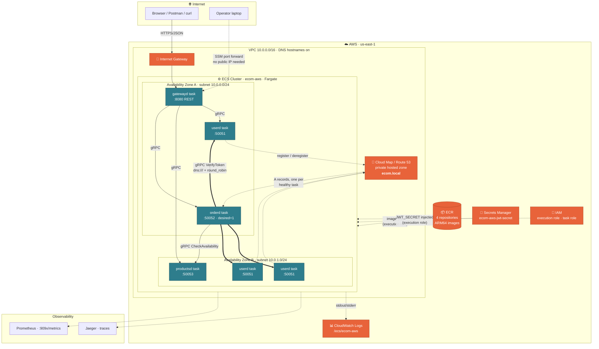
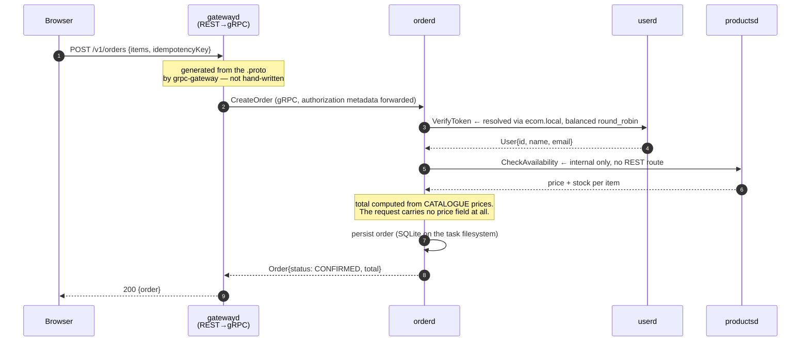

# Architecture, and what every AWS component is actually for

Two parts: [the diagram](#the-diagram), then [a component-by-component
walkthrough](#the-components-one-by-one) — what each thing *is*, why it is in
this deployment, and how it is used here.

If you only read one thing, read [the request path](#the-request-path).

---

## The diagram

GitHub renders Mermaid, so this is the version that works everywhere. The
official AWS icons are in the free
[AWS Architecture Icons deck](https://aws.amazon.com/architecture/icons/) —
use those for the slide; the shapes below map one-to-one onto them.



### The request path

A single `POST /v1/orders` with a bearer token:



Two things to say out loud about this diagram:

1. **`CreateOrderRequest` has no price field.** A client sends product ids and
   quantities. `orderd` asks `productsd` what things cost. A client must never
   be able to ask "is this price real?" and then submit a different number.
2. **`CheckAvailability` has no `google.api.http` option**, so it is reachable
   over gRPC and returns **404 over REST**. Four lines of annotation are the
   whole difference between an internal and a public API.

---

## The components, one by one

### ECS — Elastic Container Service

**What it is.** AWS's container orchestrator. You hand it a *desired state*
("run 3 copies of this container definition") and it maintains that state:
starts tasks, replaces ones that die, drains ones you remove, and reports
health. It is the same job Kubernetes does, minus the control plane you operate.

**Why it is here.** Three reasons, in order:
- gRPC needs a **listening process holding an HTTP/2 connection**. Lambda has
  none, API Gateway strips the framing, and the ALB docs state plainly that
  gRPC target groups accept only `instance` and `ip` targets — *"You can't use
  Lambda functions as targets."* That rules Lambda out on mechanics, not taste.
- Four services need four task definitions. That is the entire orchestration
  requirement. EKS does this correctly too, but asks you to own a control
  plane, node groups, CNI, ingress and an upgrade every few months first.
- A task role **is** an IAM role. No IRSA, no OIDC provider, no service account
  mapping to learn before the first deploy.

**How it is used.** One cluster, `ecom-local` / `ecom-aws`
([`terraform/modules/ecs-cluster`](../terraform/modules/ecs-cluster)), with
four services on it. The cluster itself is close to free — it is a namespace
and a capacity-provider setting, not a running thing you pay for.

> `containerInsights` is deliberately **disabled**. It costs money per metric
> and this is a demo account.

---

### Fargate

**What it is.** The *serverless compute* for ECS. With the EC2 launch type you
run and patch a fleet of instances that tasks are placed onto. With Fargate you
declare CPU and memory, and AWS runs the container on infrastructure you never
see or SSH into.

**Why it is here.** No AMI to bake, no autoscaling group, no capacity to plan.
For a talk about gRPC and ECS rather than about node management, it removes a
whole layer of things that could break on stage.

**What AWS owns, and what you still own.** This gets stated loosely a lot, so
precisely (AWS docs, verified 2026-10-09):

- AWS owns the **platform version**, which it defines as *"a combination of the
  kernel and container runtime versions."*
- When a security issue affects a platform version, *"AWS creates a new patched
  revision of the platform version **and retires tasks running on the
  vulnerable revision**."* A task never upgrades in place — **a new task gets
  the new revision**, so AWS will stop your task to patch underneath it.
- **You still own everything inside the image**: base image, packages, CVEs.
  "Serverless" is not "nobody patches".

That retirement behaviour is the reason graceful shutdown is not optional here:
your task will be replaced on someone else's schedule.

**Cost.** Fargate has no free tier, but four 0.25 vCPU / 0.5 GB tasks for the
length of a talk is a trivial amount. Rather than print per-hour rates that go
stale, check the
[Fargate pricing page](https://aws.amazon.com/fargate/pricing/) for your region.
The things that would actually run up a bill here — a NAT Gateway, RDS,
Container Insights, an ALB — are all deliberately absent.

**How it is used.** `requires_compatibilities = ["FARGATE"]`, 256 CPU units and
512 MB per task, and:

```hcl
runtime_platform {
  operating_system_family = "LINUX"
  cpu_architecture        = "ARM64"   # Graviton: cheaper, and native on an M-series Mac
}
```

ARM64 matters practically, not ideologically: `docker build --platform
linux/arm64` on an Apple-silicon laptop is a native build with no emulation,
and the image that runs on your Mac is byte-identical to the one Fargate runs.

---

### Task definition

**What it is.** The immutable, versioned blueprint for a task: which image,
which ports, how much CPU and memory, what environment variables, which
secrets, what the health check is, where logs go, how long to wait after
SIGTERM. Registering a new one creates a **new revision** — `userd:7` — and
revisions are never mutated. "Deploy" means "point the service at a newer
revision".

**Why it is here.** It is the single artifact that makes this ECS rather than
`docker compose`, and it is where every ECS-specific lesson in the talk lives.
Four of them, all in
[`terraform/modules/ecs-service/main.tf`](../terraform/modules/ecs-service/main.tf):

| Field | The lesson |
|---|---|
| `networkMode = "awsvpc"` | every task gets **its own ENI and private IP**. That is why there is no host port to connect to, and why `make forward` / SSM port forwarding exist at all |
| `healthCheck` | the runtime image is **distroless** — no shell, no `curl`, no `grpc-health-probe`. A small Go binary, `/healthcheck`, is baked in for exactly this, with an HTTP mode for `gatewayd` and a `grpc.health.v1` mode for the rest |
| `stopTimeout = 30` | ECS sends SIGTERM, waits this long, then SIGKILLs. It **must exceed** the app's own `SHUTDOWN_TIMEOUT` (15s) or the graceful drain is cut short and in-flight RPCs die anyway — which defeats the whole point of writing graceful shutdown |
| `secrets[].valueFrom` | an **ARN**, never a value. See Secrets Manager below |

**How it is used.** Four families — `userd`, `productsd`, `orderd`, `gatewayd`
— from one Terraform module, with `protocol = "grpc" \| "http"` switching the
port mapping's `appProtocol` and the health-check mode.

```sh
aws ecs describe-task-definition --task-definition userd \
  --query 'taskDefinition.{Family:family,Rev:revision,Net:networkMode,Arch:runtimePlatform.cpuArchitecture}'
```

---

### ECS service

**What it is.** The controller that keeps *N* tasks of a task definition
running. It handles rolling deployments, replaces unhealthy tasks, and
registers/deregisters tasks with service discovery and load balancers as they
come and go.

**Why it is here.** This is where the talk's central argument becomes code. The
four services have **different desired counts for storage reasons**, and
Terraform enforces it:

```hcl
validation {
  condition     = var.order_desired_count == 1
  error_message = "orderd keeps its database on the task filesystem, so N tasks would mean N divergent databases. Scale userd or productsd instead."
}
```

Run `make show-guard` on stage to show Terraform refusing the scale-out.

**How it is used.** Two details worth knowing:

- `deployment_minimum_healthy_percent` is **0 for a single-task service** and
  100 for a scaled one. A single-task service holding writable state cannot run
  two copies at once, so its deploy must stop the old task before starting the
  new one. For `userd` the 100/200 defaults give a rolling, zero-downtime
  deploy instead.
- `ignore_changes = [desired_count]`, so `make scale N=3` and autoscaling do
  not get reverted on the next `terraform apply`.

---

### ECR — Elastic Container Registry

**What it is.** A private Docker registry, with IAM for auth instead of a
username and password.

**Why it is here.** Fargate pulls from somewhere, and ECR means the pull is
authenticated by the **execution role** rather than by a credential stored in
the cluster. No `imagePullSecrets`, no registry password anywhere.

**How it is used.** Four repositories with `force_delete = true` so
`terraform destroy` is not blocked by images still sitting in them. Locally,
Ministack serves `localhost:4566/<repo>` and launches tasks through your own
Docker daemon, so there is genuinely nothing to pull.

```sh
aws ecr describe-repositories --query 'repositories[].repositoryName'
aws ecr list-images --repository-name userd
```

---

### Cloud Map and Route 53

**What they are.** **Route 53** is AWS's DNS. A *private hosted zone* is a DNS
zone that resolves only inside the VPCs you attach it to. **Cloud Map** (AWS
Cloud Map / `servicediscovery`) is the service registry that drives it: you
create a namespace, ECS registers each task as an *instance* with its IP, and
Cloud Map maintains the A records in the backing Route 53 private zone.

**This is the single most important component in the talk**, because service
discovery is the thing people assume is magic and then blame when load
balancing does not work.

**Why it is here.** `orderd` must reach `userd` and `productsd`. With `awsvpc`,
every task has a fresh private IP that changes on every deploy, so passing IPs
in as config means a two-stage apply that breaks the moment a task is replaced.
Cloud Map gives a **stable name**:

```
userd.ecom.local:50051
```

**How it is used.** Three settings carry the weight:

```hcl
routing_policy = "MULTIVALUE"   # return EVERY healthy task, not just one
dns_records { type = "A"; ttl = 10 }   # low TTL so a scale-out is seen quickly

# ECS reports task health, so Cloud Map must not probe independently.
health_check_custom_config { failure_threshold = 1 }
```

> ### The bug that cost the most time, written down so nobody repeats it
>
> An **empty** `health_check_custom_config {}` block — which looks like the
> clean way to silence a deprecation warning on `failure_threshold` — makes the
> provider send *no* custom health config at all. Cloud Map then never accepts
> ECS's health reports, every instance stays
> `AWS_INIT_HEALTH_STATUS=UNHEALTHY`, unhealthy instances are **excluded from
> DNS answers**, and clients fail with:
>
> ```
> rpc error: code = Unavailable desc = ... "no children to pick from"
> ```
>
> Meanwhile every ECS task shows RUNNING, all four Cloud Map services exist,
> and VPC DNS is enabled. Everything looks healthy. Verified on real AWS,
> 2026-10-09. AWS forces the value to `1` regardless, so the deprecation
> warning is cosmetic — **but the block is required.**

Check it like this, and believe the `HealthStatus`, not the console:

```sh
NS=$(aws servicediscovery list-namespaces --query 'Namespaces[0].Id' --output text)
SVC=$(aws servicediscovery list-services --query 'Services[?Name==`userd`].Id' --output text)
aws servicediscovery get-instances-health-status --service-id "$SVC"

ZONE=$(aws route53 list-hosted-zones-by-name --dns-name ecom.local \
  --query 'HostedZones[0].Id' --output text)
aws route53 list-resource-record-sets --hosted-zone-id "$ZONE" \
  --query 'ResourceRecordSets[?Type==`A`].{Name:Name,IPs:ResourceRecords[].Value}'
```

Three A records for `userd.ecom.local` across two AZs is what a working
scale-out looks like.

**And then the client still has to ask for balancing.** Three A records
returned and 100% of traffic on one task is the normal outcome, because
grpc-go's default policy is `pick_first`: resolve, connect to one address,
multiplex everything over that one HTTP/2 connection. Both halves of the fix
are required —

```go
// client: balance per RPC, and resolve every A record. A bare "host:port"
// uses the PASSTHROUGH resolver and yields exactly one address, so
// round_robin on its own has nothing to balance over.
grpc.NewClient("dns:///userd.ecom.local:50051",
    grpc.WithDefaultServiceConfig(`{"loadBalancingConfig":[{"round_robin":{}}]}`))

// server: recycle connections so clients re-resolve after a scale-out.
// Without this, a client connected BEFORE the scale-out never discovers the
// new tasks, whatever policy it uses.
grpc.KeepaliveParams(keepalive.ServerParameters{
    MaxConnectionAge:      30 * time.Second,
    MaxConnectionAgeGrace: 5 * time.Second,
})
```

**Locally:** Ministack stores Cloud Map registrations but serves no DNS, and
Terraform cannot even create the services against it (Ministack wants a
top-level `NamespaceId`; the AWS provider nests it in `DnsConfig`). So locally
`enable_service_discovery = false` and `make dns` attaches a Docker network
alias to every task container instead. That substitution is legitimate, and
worth saying out loud: **service discovery is only DNS underneath.** Docker's
embedded DNS returns all A records for a shared alias, which is exactly why the
local load-balancing demo works at all.

---

### Secrets Manager

**What it is.** Managed storage for secrets, with IAM-controlled access,
versioning and rotation.

**Why it is here.** `userd` signs JWTs with HS256. With `userd` scaled to three
tasks, **all three must hold the same key**, or a token minted by task A is
rejected by task B and the demo collapses into intermittent 401s that look like
a load-balancing bug. One secret, three tasks, no key in the image and no key
in git.

**How it is used.** The task definition stores an **ARN**. The ECS agent — not
your code — resolves it at task start using the *execution* role and injects
the value as an environment variable. The application reads `JWT_SECRET` and
knows nothing about AWS.

```hcl
secrets = { JWT_SECRET = aws_secretsmanager_secret.jwt.arn }
```

The IAM policy is scoped to that exact ARN, not `secretsmanager:*`. Prove the
value never leaves AWS:

```sh
aws ecs describe-task-definition --task-definition userd \
  --query 'taskDefinition.containerDefinitions[0].secrets'
```

`recovery_window_in_days = 0` on the secret, so `terraform destroy` really
deletes it instead of leaving a 30-day scheduled deletion that blocks the next
apply with the same name.

---

### CloudWatch Logs

**What it is.** AWS's log store. Groups contain streams; streams contain lines.

**Why it is here.** A Fargate task has no filesystem you can go and read, and
when it is replaced its stdout is gone with it. The `awslogs` driver is how you
see why a task crash-looped.

**How it is used.** One log group, `/ecs/ecom-aws`, with
`awslogs-stream-prefix` per service so a stream name identifies the service and
the task. `retention_in_days = 1`, because a demo account should not accrue log
storage.

```sh
aws logs tail /ecs/ecom-aws --since 10m --follow
```

> This is not a nice-to-have. The OTel semconv mismatch that crash-looped
> every task on the first real deploy was **only** visible here — the ECS
> console just showed tasks cycling, and the failure was invisible locally
> because with no OTLP endpoint configured the tracer short-circuits to a
> no-op.

---

### IAM — two roles, and the difference matters

| Role | Who uses it | For what |
|---|---|---|
| **Execution role** | the **ECS agent**, *before* your code runs | pull the image from ECR, resolve `secrets` from Secrets Manager, create log streams |
| **Task role** | **your process**, at runtime | the credentials the AWS SDK picks up inside the container |

**Why it is here, and why the task role is empty.** These two get conflated
constantly, and the symptom of getting it wrong is a task that will not start
with an error that points at the wrong role. In this deployment the task role
is **deliberately empty**: the services call no AWS API at runtime. Nothing is
granted "just in case".

**How it is used.** The execution role gets the managed
`AmazonECSTaskExecutionRolePolicy` plus one inline statement scoped to the JWT
secret's exact ARN. The task role gets nothing unless `enable_execute_command`
is on — and then the `ssmmessages` permissions go on the **task** role, not the
execution role, because the agent uses the task's own credentials for that
channel.

The best thing to show on stage is one `docker inspect`:

```sh
CID=$(docker ps --filter "name=ministack-ecs-.*-userd$" --format '{{.Names}}' | head -1)
docker inspect "$CID" --format '{{range .Config.Env}}{{println .}}{{end}}' \
  | grep AWS_CONTAINER_CREDENTIALS
```

`AWS_CONTAINER_CREDENTIALS_FULL_URI` is the entire "no API keys on ECS" story
in one line: the SDK reads that variable and fetches temporary credentials. You
never created an access key, and there is none to leak.

---

### VPC, subnets, Internet Gateway, security group

**What they are.** The network. A VPC is a private IP space; subnets divide it
per availability zone; an Internet Gateway gives a subnet a route to the
internet; a security group is a stateful allow-list attached to an ENI.

**Why it is shaped this way.** Two deliberate decisions:

- **`enable_dns_hostnames = true`** is *required* for a Cloud Map private DNS
  namespace. Miss it and service discovery silently resolves nothing.
- **Public subnets, and no NAT Gateway.** A NAT Gateway costs about **$33/month** before traffic ($0.045 per hour in AWS's own pricing example, plus $0.045 per GB processed) —
  the most common way a demo account quietly bleeds money.
  Tasks get public IPs (`assign_public_ip = true`) so they can reach ECR,
  Secrets Manager and CloudWatch directly. **For production you would do the
  opposite:** private subnets plus VPC endpoints for `ecr.api`, `ecr.dkr`,
  `s3`, `logs` and `secretsmanager` — cheaper than NAT at this scale, and it
  keeps the traffic off the internet entirely. Say that out loud rather than
  letting someone think public subnets are the recommendation.

**How it is used.** Two AZs. One security group for all tasks, with a
**self-referencing** ingress rule — that one rule is how `orderd` reaches
`userd` and `productsd` privately, with no CIDR to maintain. External access
is a separate, empty-by-default rule locked to the operator's `/32`.

> Check your egress IP **from the venue** (`curl ifconfig.me`): the conference
> NAT is probably not the IP you allow-listed from home. And make sure it is
> IPv4 — an IPv6 address in a `cidr_ipv4` field fails the apply partway
> through.

---

### What is deliberately NOT here

| Missing | Why |
|---|---|
| **ALB** | a gRPC target group needs an **HTTPS listener plus an ACM certificate**, which means a domain. Above the cut line for a 40-minute talk. Cloud Map covers the internal hops; `gatewayd` is the one thing an ALB belongs in front of, and that is a slide, not a demo |
| **RDS** | adds 5–10 minutes to every apply, and bills by the hour if you forget to destroy it. Dropping it takes the AWS apply from ~10 minutes to **~2**. For anything real, use RDS: `DB_DRIVER=postgres` plus a DSN in `DB_URL` is the whole application-side switch |
| **EFS for the SQLite file** | SQLite's own documentation warns that network filesystems cause **database corruption**. Not a cost decision — a correctness one |
| **NAT Gateway** | see above |
| **Container Insights** | costs money per metric; Prometheus and Jaeger cover the demo |
| **Autoscaling policies** | `make scale N=3` is more honest on stage than waiting for a CloudWatch alarm to fire |

---

## One stack, two environments

The thing worth putting on the screen at the end:

```sh
diff terraform/envs/local/provider.tf terraform/envs/aws/provider.tf
```

Everything describing the deployment lives in
[`terraform/deployment/`](../terraform/deployment) and is **the same files** in both. The only
difference between running on your laptop and running on AWS is the provider
block: fake credentials, a few `skip_*` flags and an `endpoints` block locally;
on AWS, a region and nothing else.

```hcl
# envs/aws/provider.tf
provider "aws" {
  region = var.aws_region
}
```

That is the whole argument for emulating locally instead of maintaining a
second, simpler set of local manifests: there is no second set to drift.
